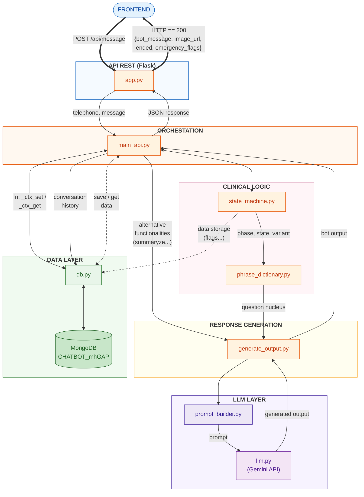

```mermaid
flowchart TD
    FE([FRONTEND]):::external

    subgraph API["<b>API REST (Flask)</b>"]
        APP["app.py"]:::module
    end

    subgraph ORCH["<b>ORCHESTATION</b>"]
        MAIN["main_api.py"]:::module
    end

    subgraph CLINICAL["<b>CLINICAL LOGIC</b>"]
        FSM_MOD["state_machine.py"]:::module
        PHRASE["phrase_dictionary.py"]:::module
    end

    subgraph GENOUT["<b>RESPONSE GENERATION</b>"]
        GEN["generate_output.py"]:::module
    end

    subgraph LLM_L["<b>LLM LAYER</b>"]
        PB["prompt_builder.py"]:::prompt
        LLM["llm.py\n(Gemini API)"]:::llm
    end

    subgraph DB_L["<b>DATA LAYER</b>"]
        DB["db.py"]:::dbmod
        MONGO[("MongoDB\nCHATBOT_mhGAP")]:::db
    end

    FE ==>|"POST /api/message"| APP
    APP -->|"telephone, message"| MAIN
    MAIN <-->|"fn: _ctx_set / \n_ctx_get"| DB
    MAIN -->|"conversation\nhistory"| DB
    MAIN <-.->|"save / get \ndata"| DB
    MAIN <--> FSM_MOD
    MAIN --> |"alternative\nfunctionalities\n(summaryze...)"| GEN
    FSM_MOD -->|"phase, state, variant"| PHRASE
    PHRASE -->|"question nucleus"| GEN
    GEN --> PB
    PB -->|"prompt"| LLM
    LLM -->|"generated output"| GEN
    GEN -->|"bot output"| MAIN
    DB <--> MONGO
    MAIN -->|"JSON response"| APP
    APP ==>|"HTTP == 200<br/>{bot_message, image_url, ended, emergency_flags}"| FE
    FSM_MOD -.-> |"data storage<br/>(flags...)"|DB

    classDef external fill:#e3f2fd,stroke:#1565c0,color:#0d47a1
    classDef module  fill:#fff3e0,stroke:#e65100,color:#bf360c
    classDef prompt  fill:#ede7f6,stroke:#4527a0,color:#311b92
    classDef llm     fill:#f3e5f5,stroke:#6a1b9a,color:#4a148c
    classDef dbmod   fill:#e8f5e9,stroke:#2e7d32,color:#1b5e20
    classDef db      fill:#c8e6c9,stroke:#1b5e20,color:#1b5e20

    style API      fill:#f5faff,stroke:#1565c0
    style ORCH     fill:#fff8f0,stroke:#e65100
    style CLINICAL fill:#fff5f8,stroke:#ad1457
    style GENOUT   fill:#fffef0,stroke:#f9a825
    style LLM_L    fill:#f7f3ff,stroke:#4527a0
    style DB_L     fill:#f0faf0,stroke:#2e7d32
```