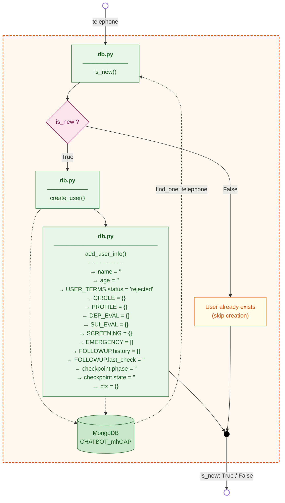

```mermaid
flowchart TD
 
    START(( )):::circle
    FINISH(( )):::circle
 
    START -->|"telephone"| IS_NEW
 
    subgraph INIT_FLOW[" "]
 
        IS_NEW["<b>db.py</b><br/>───────────<br/>is_new()"]:::dbmod
 
        D_NEW{is_new ?}:::decision
 
        CREATE["<b>db.py</b><br/>──────────<br/>create_user()"]:::dbmod

        ADD["<b>db.py</b><br/>─────────────────────────<br/>add_user_info()<br/>· · · · · · · · · ·<br/>→ name = ''<br/>→ age = ''<br/>→ USER_TERMS.status = 'rejected'<br/>→ CIRCLE = {}<br/>→ PROFILE = {}<br/>→ DEP_EVAL = {}<br/>→ SUI_EVAL = {}<br/>→ SCREENING = {}<br/>→ EMERGENCY = []<br/>→ FOLLOWUP.history = []<br/>→ FOLLOWUP.last_check = ''<br/>→ checkpoint.phase = ''<br/>→ checkpoint.state = ''<br/>→ ctx = {}"]:::dbmod
 
        SKIP["User already exists<br/>(skip creation)"]:::flowblock
 
        MONGO[("MongoDB<br/>CHATBOT_mhGAP")]:::db

        BOTTOM(( )):::junction
 
        IS_NEW --> D_NEW
        D_NEW -->|True| CREATE --> ADD --> BOTTOM
        D_NEW -->|False| SKIP --> BOTTOM
 
        MONGO -.->|find_one: telephone| IS_NEW
        CREATE -.-> MONGO
        ADD -.-> MONGO
 
    end
 
    BOTTOM -->|"is_new: True / False"| FINISH
 
    classDef circle    fill:#ffffff,stroke:#9370db,stroke-width:2px,color:#ffffff
    classDef junction  fill:#000000,stroke:#000000,color:#000000
    classDef module    fill:#fff3e0,stroke:#e65100,color:#bf360c
    classDef flowblock fill:#fffde7,stroke:#f57f17,color:#e65100
    classDef decision  fill:#fce4ec,stroke:#ad1457,color:#880e4f
    classDef dbmod     fill:#e8f5e9,stroke:#2e7d32,color:#1b5e20
    classDef db        fill:#c8e6c9,stroke:#1b5e20,color:#1b5e20
 
    style INIT_FLOW fill:#fff8f0,stroke:#e65100,stroke-width:2px,stroke-dasharray: 6 3
```