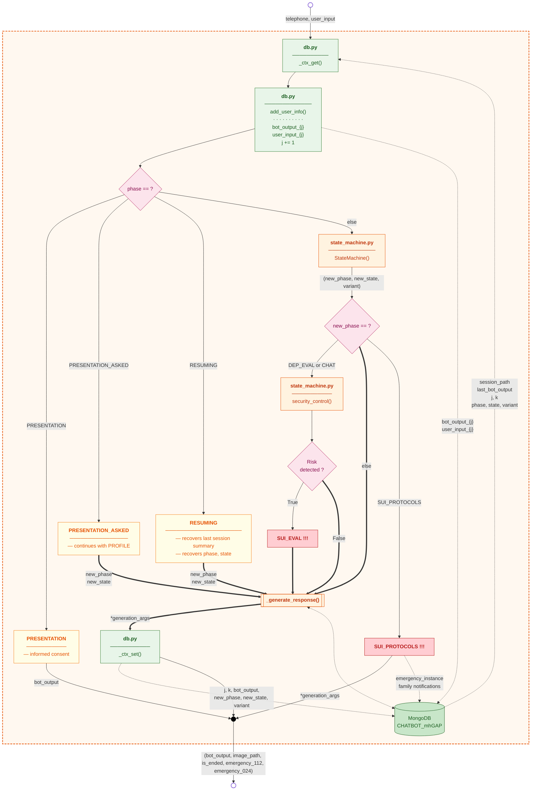

```mermaid
flowchart TD

    START(( )):::circle
    FINISH(( )):::circle

    START -->|"telephone, user_input"| CTX_GET

    subgraph PROCESS_MSG[" "]

        CTX_GET["<b>db.py</b><br/>──────────<br/>_ctx_get()"]:::dbmod
        HIST["<b>db.py</b><br/>─────────────<br/>add_user_info()<br/>· · · · · · · · · ·<br/>bot_output_{j}<br/>user_input_{j}<br/>j += 1"]:::dbmod

        SWITCH{phase == ?}:::decision

        PRES["<b>PRESENTATION</b><br/>───────────<br/>— informed consent"]:::flowblock

        PRES_ASK["<b>PRESENTATION_ASKED</b><br/>────────────────<br/>— continues with PROFILE"]:::flowblock

        RES["<b>RESUMING</b><br/>─────────────────────<br/>— recovers last session summary<br/>— recovers phase, state"]:::flowblock

        FSM["<b>state_machine.py</b><br/>─────────────<br/>StateMachine()"]:::module

        FSM_GATE{new_phase == ?}:::decision

        SEC["<b>state_machine.py</b><br/>───────────<br/>security_control()"]:::module

        RISK{Risk<br/>detected ?}:::decision

        EMERGENCY["<b>SUI_EVAL !!!</b>"]:::emergency

        SUI_PROT["<b>SUI_PROTOCOLS !!!</b>"]:::emergency

        GEN_RESP[["<b>_generate_response()</b>"]]:::module

        CTX_SET["<b>db.py</b><br/>───────────<br/>_ctx_set()"]:::dbmod

        MONGO[("MongoDB<br/>CHATBOT_mhGAP")]:::db

        BOTTOM(( )):::junction

        CTX_GET --> HIST
        HIST --> SWITCH

        SWITCH -->|"PRESENTATION"| PRES 
        SWITCH -->|"PRESENTATION_ASKED"| PRES_ASK ==>|new_phase\nnew_state| GEN_RESP
        SWITCH -->|"RESUMING"| RES ==>|new_phase\nnew_state| GEN_RESP
        SWITCH -->|"else"| FSM

        FSM -->|"(new_phase, new_state, variant)"| FSM_GATE
        FSM_GATE -->|"DEP_EVAL or CHAT"| SEC --> RISK
        FSM_GATE ==>|"else"| GEN_RESP
        FSM_GATE -->|"SUI_PROTOCOLS"| SUI_PROT 
        
        RISK -->|True| EMERGENCY ==> GEN_RESP
        RISK ==>|False| GEN_RESP

        GEN_RESP ==>|"*generation_args"| CTX_SET

        MONGO -.->|"session_path<br/>last_bot_output<br/>j, k<br/>phase, state, variant"| CTX_GET
        HIST -.->|"bot_output_{j}<br/>user_input_{j}"| MONGO
        SUI_PROT -->|"*generation_args"| BOTTOM
        CTX_SET -.->|"j, k, bot_output,<br/>new_phase, new_state, variant"| MONGO
        CTX_SET --> BOTTOM
        
        GEN_RESP <-.-> MONGO
        SUI_PROT -.->|"emergency_instance<br/>family notifications"| MONGO
        PRES -->|"bot_output"| BOTTOM

    end

    BOTTOM -->|"(bot_output, image_path, is_ended, emergency_112, emergency_024)"| FINISH

    classDef circle    fill:#ffffff,stroke:#9370db,stroke-width:2px,color:#ffffff
    classDef junction  fill:#000000,stroke:#000000,color:#000000
    classDef module    fill:#fff3e0,stroke:#e65100,color:#bf360c
    classDef flowblock fill:#fffde7,stroke:#f57f17,color:#e65100
    classDef decision  fill:#fce4ec,stroke:#ad1457,color:#880e4f
    classDef dbmod     fill:#e8f5e9,stroke:#2e7d32,color:#1b5e20
    classDef db        fill:#c8e6c9,stroke:#1b5e20,color:#1b5e20
    classDef emergency fill:#ffcdd2,stroke:#b71c1c,color:#b71c1c

    style PROCESS_MSG fill:#fff8f0,stroke:#e65100,stroke-width:2px,stroke-dasharray: 6 3
```