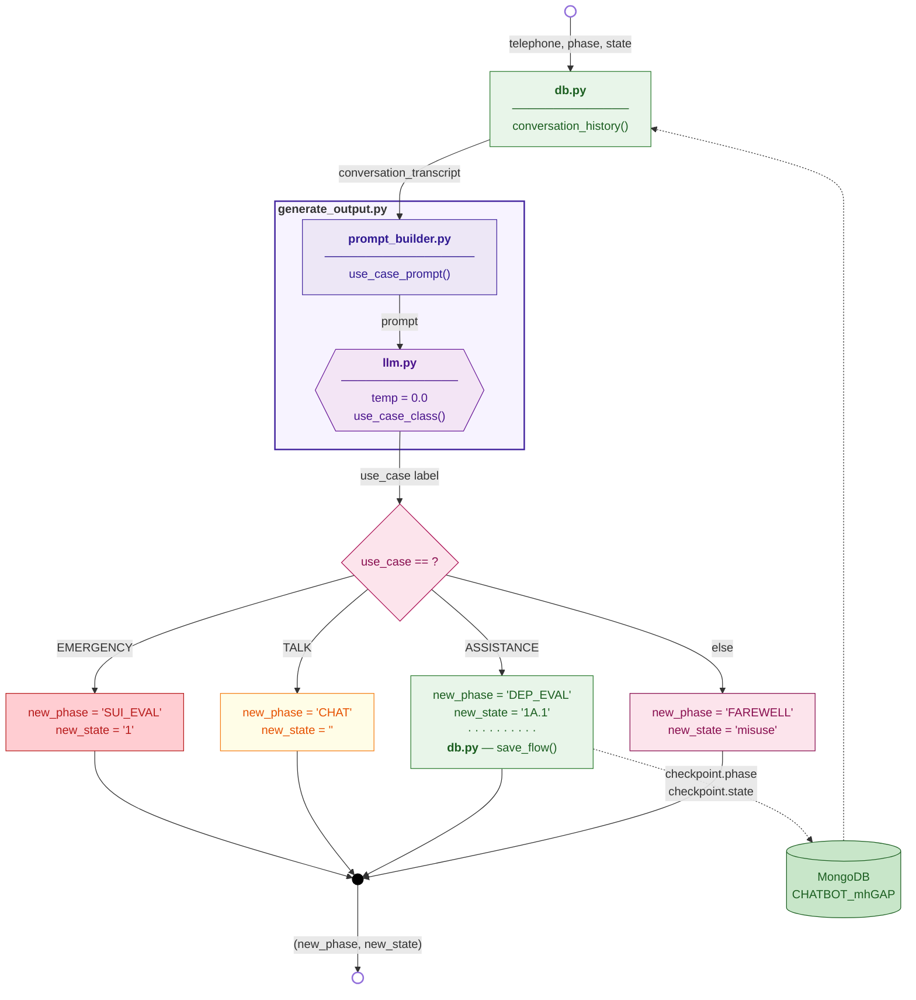

```mermaid
flowchart TD

    START(( )):::circle
    JUNCTION(( )):::junction
    FINISH(( )):::circle

    MONGO[("MongoDB<br/>CHATBOT_mhGAP")]:::db

    CTX["<b>db.py</b><br/>──────────────<br/>conversation_history()<br/>"]:::dbmod

    subgraph UC_BLOCK["<b>generate_output.py &nbsp;&nbsp;&nbsp;&nbsp;&nbsp;&nbsp;&nbsp;&nbsp;&nbsp;&nbsp;&nbsp;&nbsp;&nbsp;&nbsp;&nbsp;&nbsp;&nbsp;&nbsp;&nbsp;&nbsp;&nbsp;&nbsp;&nbsp;&nbsp;&nbsp;&nbsp;&nbsp;&nbsp;&nbsp;&nbsp;&nbsp;&nbsp;&nbsp;&nbsp;&nbsp;&nbsp;&nbsp;&nbsp;&nbsp;&nbsp;</b>"]
        PB["<b>prompt_builder.py</b><br/>──────────────────<br/>use_case_prompt()"]:::prompt
        LLM{{"<b>llm.py</b><br/>──────────────<br/>temp = 0.0<br/>use_case_class()"}}:::llm
    end

    SWITCH{use_case == ?}:::decision

    EM["new_phase = 'SUI_EVAL'<br/>new_state = '1'"]:::emergency

    AS["new_phase = 'DEP_EVAL'<br/>new_state = '1A.1'<br/>· · · · · · · · · ·<br/><b>db.py</b> — save_flow()"]:::dbmod

    TK["new_phase = 'CHAT'<br/>new_state = ''"]:::flowblock

    MS["new_phase = 'FAREWELL'<br/>new_state = 'misuse'"]:::farewell

    START -->|"telephone, phase, state"| CTX
    CTX -->|"conversation_transcript"| PB
    PB -->|"prompt"| LLM
    LLM -->|"use_case label"| SWITCH

    SWITCH -->|"EMERGENCY"| EM --> JUNCTION
    SWITCH -->|"TALK"| TK --> JUNCTION
    SWITCH -->|"ASSISTANCE"| AS --> JUNCTION 
    SWITCH -->|"else"| MS --> JUNCTION

    MONGO -.-> CTX
    AS -.->|"checkpoint.phase\ncheckpoint.state"| MONGO

    JUNCTION -->|"(new_phase, new_state)"| FINISH

    classDef circle    fill:#ffffff,stroke:#9370db,stroke-width:2px,color:#ffffff
    classDef junction  fill:#000000,stroke:#000000,color:#000000
    classDef decision  fill:#fce4ec,stroke:#ad1457,color:#880e4f
    classDef dbmod     fill:#e8f5e9,stroke:#2e7d32,color:#1b5e20
    classDef db        fill:#c8e6c9,stroke:#1b5e20,color:#1b5e20
    classDef prompt    fill:#ede7f6,stroke:#4527a0,color:#311b92
    classDef llm       fill:#f3e5f5,stroke:#6a1b9a,color:#4a148c
    classDef flowblock fill:#fffde7,stroke:#f57f17,color:#e65100
    classDef emergency fill:#ffcdd2,stroke:#b71c1c,color:#b71c1c
    classDef farewell  fill:#fce4ec,stroke:#880e4f,color:#880e4f

    style UC_BLOCK fill:#f7f3ff,stroke:#4527a0,stroke-width:2px
```