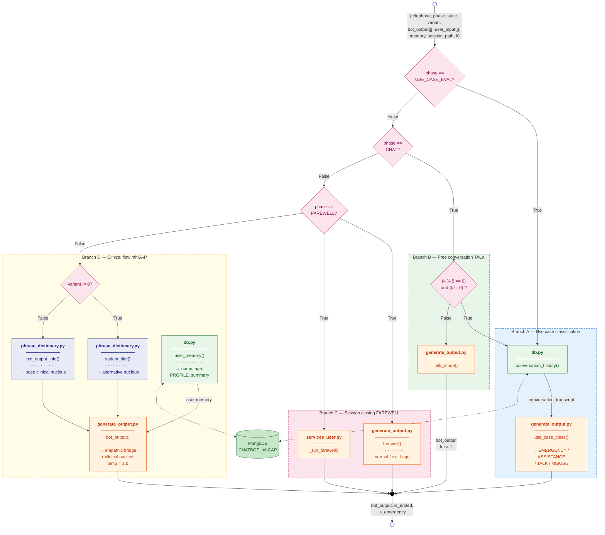

```mermaid
flowchart TD

    START(( )):::circle
    JUNCTION(( )):::junction
    FINISH(( )):::circle

    MONGO[("MongoDB<br/>CHATBOT_mhGAP")]:::db

    D_UC{phase ==<br/>USE_CASE_EVAL?}:::decision
    D_CH{phase ==<br/>CHAT?}:::decision
    D_FW{phase ==<br/>FAREWELL?}:::decision

    subgraph BRANCH_UC["Branch A — Use case classification"]
        DB_H["<b>db.py</b><br/>──────────────<br/>conversation_history()"]:::dbmod
        UC["<b>generate_output.py</b><br/>───────────<br/>use_case_class()<br/>· · · · · · · · · ·<br/>→ EMERGENCY / ASSISTANCE<br/>/ TALK / MISUSE"]:::module
    end

    subgraph BRANCH_CH["Branch B — Free conversation TALK"]
        TALK["<b>generate_output.py</b><br/>───────────<br/>talk_mode()"]:::module
        KCHAT{"(k % 5 == 0) \nand (k != 0) ?"}:::decision
    end

    subgraph BRANCH_FW["Branch C — Session closing FAREWELL"]
        FW["<b>generate_output.py</b><br/>───────────<br/>farewell()<br/>· · · · · · · · · ·<br/>normal / exit / age"]:::module
        RUN_FW["<b>services_user.py</b><br/>───────────<br/>_run_farewell()"]:::module
    end

    subgraph BRANCH_NM["Branch D — Clinical flow mhGAP"]
        D_VAR{variant != 0?}:::decision
        PVAR["<b>phrase_dictionary.py</b><br/>───────────<br/>variant_dict()<br/>· · · · · · · · · ·<br/>→ alternative nucleus"]:::phrase
        PBASE["<b>phrase_dictionary.py</b><br/>───────────<br/>bot_output_info()<br/>· · · · · · · · · ·<br/>→ base clinical nucleus"]:::phrase
        MEM["<b>db.py</b><br/>───────────<br/>user_memory()<br/>· · · · · · · · · ·<br/>→ name, age,<br/>PROFILE, summary"]:::dbmod
        BOUT["<b>generate_output.py</b><br/>───────────<br/>bot_output()<br/>· · · · · · · · · ·<br/>→ empathic bridge<br/>+ clinical nucleus<br/>temp = 1.0"]:::module
    end

    START -->|"(telephone, phase, state, variant,<br/>bot_output{j}, user_input{j}, memory, session_path, k)"| D_UC

    D_UC -->|True| DB_H -->|"conversation_transcript"| UC --> JUNCTION
    D_UC -->|False| D_CH

    D_CH -->|True| KCHAT
    KCHAT -->|True| DB_H
    KCHAT -->|False| TALK
    TALK -->|bot_output\nk += 1| JUNCTION
    D_CH -->|False| D_FW

    D_FW -->|True| FW & RUN_FW --> JUNCTION
    D_FW -->|False| D_VAR

    D_VAR -->|True| PVAR --> BOUT
    D_VAR -->|False| PBASE --> BOUT
    MEM -.->|"user memory"| BOUT
    BOUT --> JUNCTION

    DB_H <-.-> MONGO
    MEM <-.-> MONGO

    JUNCTION -->|"bot_output, is_ended,<br/>is_emergency"| FINISH

    classDef circle   fill:#ffffff,stroke:#9370db,stroke-width:2px,color:#ffffff
    classDef junction fill:#000000,stroke:#000000,color:#000000
    classDef module   fill:#fff3e0,stroke:#e65100,color:#bf360c
    classDef decision fill:#fce4ec,stroke:#ad1457,color:#880e4f
    classDef dbmod    fill:#e8f5e9,stroke:#2e7d32,color:#1b5e20
    classDef db       fill:#c8e6c9,stroke:#1b5e20,color:#1b5e20
    classDef phrase   fill:#e8eaf6,stroke:#283593,color:#1a237e

    style BRANCH_UC fill:#e3f2fd,stroke:#1565c0,stroke-dasharray: 6 3
    style BRANCH_CH fill:#e8f5e9,stroke:#2e7d32,stroke-dasharray: 6 3
    style BRANCH_FW fill:#fce4ec,stroke:#ad1457,stroke-dasharray: 6 3
    style BRANCH_NM fill:#fffde7,stroke:#f57f17,stroke-dasharray: 6 3
```