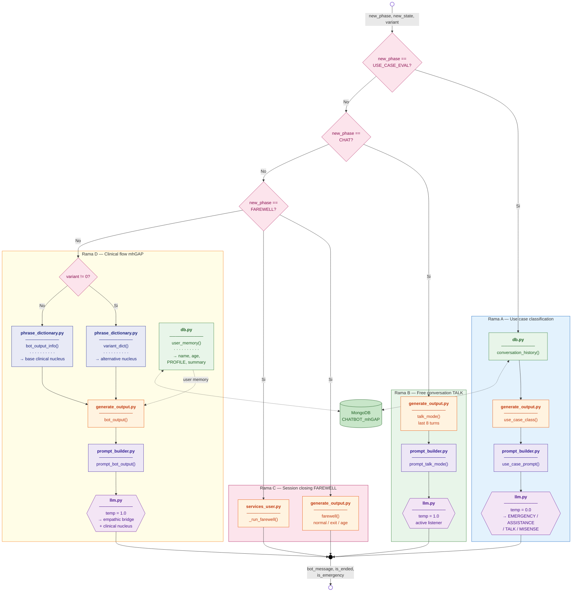

```mermaid
flowchart TD

    START(( )):::circle
    JUNCTION(( )):::junction
    FINISH(( )):::circle

    MONGO[("MongoDB<br/>CHATBOT_mhGAP")]:::db

    D_UC{new_phase ==<br/>USE_CASE_EVAL?}:::decision
    D_CH{new_phase ==<br/>CHAT?}:::decision
    D_FW{new_phase ==<br/>FAREWELL?}:::decision

    subgraph BRANCH_UC["Rama A — Use case classification"]
        DB_H["<b>db.py</b><br/>───────────<br/>conversation_history()"]:::dbmod
        UC["<b>generate_output.py</b><br/>───────────<br/>use_case_class()"]:::module
        PB_UC["<b>prompt_builder.py</b><br/>───────────<br/>use_case_prompt()"]:::prompt
        LLM_UC{{"<b>llm.py</b><br/>───────────<br/>temp = 0.0<br/>→ EMERGENCY / ASSISTANCE<br/>/ TALK / MISENSE"}}:::llm
    end

    subgraph BRANCH_CH["Rama B — Free conversation TALK"]
        TALK["<b>generate_output.py</b><br/>───────────<br/>talk_mode()<br/>last 8 turns"]:::module
        PB_TK["<b>prompt_builder.py</b><br/>───────────<br/>prompt_talk_mode()"]:::prompt
        LLM_TK{{"<b>llm.py</b><br/>───────────<br/>temp = 1.0<br/>active listener"}}:::llm
    end

    subgraph BRANCH_FW["Rama C — Session closing FAREWELL"]
        FW["<b>generate_output.py</b><br/>───────────<br/>farewell()<br/>normal / exit / age"]:::module
        RUN_FW["<b>services_user.py</b><br/>───────────<br/>_run_farewell()"]:::module
    end

    subgraph BRANCH_NM["Rama D — Clinical flow mhGAP"]
        D_VAR{variant != 0?}:::decision
        PVAR["<b>phrase_dictionary.py</b><br/>───────────<br/>variant_dict()<br/>· · · · · · · · · ·<br/>→ alternative nucleus"]:::phrase
        PBASE["<b>phrase_dictionary.py</b><br/>───────────<br/>bot_output_info()<br/>· · · · · · · · · ·<br/>→ base clinical nucleus"]:::phrase
        MEM["<b>db.py</b><br/>───────────<br/>user_memory()<br/>· · · · · · · · · ·<br/>→ name, age,<br/>PROFILE, summary"]:::dbmod
        BOUT["<b>generate_output.py</b><br/>───────────<br/>bot_output()"]:::module
        PB_BO["<b>prompt_builder.py</b><br/>───────────<br/>prompt_bot_output()"]:::prompt
        LLM_BO{{"<b>llm.py</b><br/>───────────<br/>temp = 1.0<br/>→ empathic bridge<br/>+ clinical nucleus"}}:::llm
    end

    START -->|"new_phase, new_state, variant"| D_UC

    D_UC -->|Si| DB_H --> UC --> PB_UC --> LLM_UC --> JUNCTION
    D_UC -->|No| D_CH

    D_CH -->|Si| TALK --> PB_TK --> LLM_TK --> JUNCTION
    D_CH -->|No| D_FW

    D_FW -->|Si| FW & RUN_FW --> JUNCTION
    D_FW -->|No| D_VAR

    D_VAR -->|Si| PVAR --> BOUT
    D_VAR -->|No| PBASE --> BOUT
    MEM -.->|"user memory"| BOUT
    BOUT --> PB_BO --> LLM_BO --> JUNCTION

    DB_H <-.-> MONGO
    MEM <-.-> MONGO

    JUNCTION -->|"bot_message, is_ended,<br/>is_emergency"| FINISH

    classDef circle   fill:#ffffff,stroke:#9370db,stroke-width:2px,color:#ffffff
    classDef junction fill:#000000,stroke:#000000,color:#000000
    classDef module   fill:#fff3e0,stroke:#e65100,color:#bf360c
    classDef decision fill:#fce4ec,stroke:#ad1457,color:#880e4f
    classDef dbmod    fill:#e8f5e9,stroke:#2e7d32,color:#1b5e20
    classDef db       fill:#c8e6c9,stroke:#1b5e20,color:#1b5e20
    classDef llm      fill:#f3e5f5,stroke:#6a1b9a,color:#4a148c
    classDef prompt   fill:#ede7f6,stroke:#4527a0,color:#311b92
    classDef phrase   fill:#e8eaf6,stroke:#283593,color:#1a237e

    style BRANCH_UC fill:#e3f2fd,stroke:#1565c0
    style BRANCH_CH fill:#e8f5e9,stroke:#2e7d32
    style BRANCH_FW fill:#fce4ec,stroke:#ad1457
    style BRANCH_NM fill:#fffde7,stroke:#f57f17
```