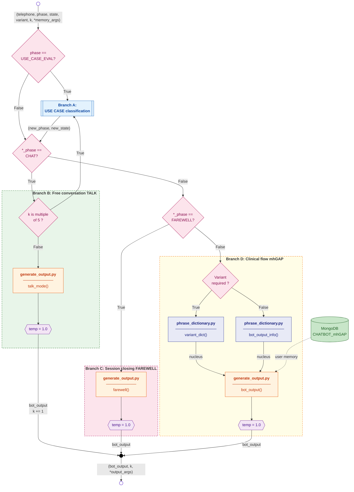

```mermaid
flowchart TD

    START(( )):::circle
    JUNCTION(( )):::junction
    FINISH(( )):::circle

    MONGO[("MongoDB<br/>CHATBOT_mhGAP")]:::db

    D_UC{phase ==<br/>USE_CASE_EVAL?}:::decision
    D_CH{*_phase ==<br/>CHAT?}:::decision
    D_FW{*_phase ==<br/>FAREWELL?}:::decision

    BRANCH_UC[["<b>Branch A:\nUSE CASE classification</b>"]]:::external

    subgraph BRANCH_CH["<b>&nbsp;&nbsp;&nbsp;&nbsp;&nbsp;&nbsp;&nbsp;&nbsp;&nbsp;&nbsp;&nbsp;&nbsp;&nbsp;&nbsp;&nbsp;&nbsp;&nbsp;&nbsp;&nbsp;&nbsp;&nbsp;&nbsp;&nbsp;&nbsp;&nbsp;&nbsp;Branch B: Free conversation TALK</b>"]
        TALK["<b>generate_output.py</b><br/>───────────<br/>talk_mode()"]:::module
        LLM_TK{{"temp = 1.0"}}:::llm
        KCHAT{"k is multiple \nof 5 ?"}:::decision
    end

    subgraph BRANCH_FW["<b>Branch C: Session closing FAREWELL</b>"]
        FW["<b>generate_output.py</b><br/>───────────<br/>farewell()"]:::module
        LLM_FW{{"temp = 1.0"}}:::llm
    end

    subgraph BRANCH_NM["<b>&nbsp;&nbsp;&nbsp;&nbsp;&nbsp;&nbsp;&nbsp;&nbsp;&nbsp;&nbsp;&nbsp;&nbsp;&nbsp;&nbsp;&nbsp;&nbsp;&nbsp;&nbsp;&nbsp;&nbsp;&nbsp;&nbsp;&nbsp;&nbsp;&nbsp;&nbsp;&nbsp;&nbsp;&nbsp;&nbsp;&nbsp;&nbsp;&nbsp;&nbsp;&nbsp;&nbsp;&nbsp;&nbsp;&nbsp;&nbsp;&nbsp;&nbsp;&nbsp;&nbsp;Branch D: Clinical flow mhGAP</b>"]
        D_VAR{Variant\nrequired ?}:::decision
        PVAR["<b>phrase_dictionary.py</b><br/>───────────────<br/>variant_dict()"]:::phrase
        PBASE["<b>phrase_dictionary.py</b><br/>───────────────<br/>bot_output_info()"]:::phrase
        BOUT["<b>generate_output.py</b><br/>──────────────<br/>bot_output()"]:::module
        LLM_BO{{"temp = 1.0"}}:::llm
    end

    START -->|"(telephone, phase, state, variant, k, *memory_args)"| D_UC
    
    D_UC -->|True| BRANCH_UC
    D_UC -->|False| D_CH

    KCHAT -->|True| BRANCH_UC
    D_CH -->|False| D_FW
    D_CH -->|True| KCHAT

    KCHAT -->|False| TALK
    TALK --> LLM_TK -->|"bot_output\nk += 1"| JUNCTION

    BRANCH_UC -->|"(new_phase, new_state)"| D_CH

    D_FW -->|True| FW --> LLM_FW -->|"bot_output"| JUNCTION
    D_FW -->|False| D_VAR

    D_VAR -->|True| PVAR -->|"nucleus"| BOUT
    D_VAR -->|False| PBASE -->|"nucleus"| BOUT
    MONGO -.->|"user memory"| BOUT
    BOUT --> LLM_BO -->|"bot_output"| JUNCTION

    JUNCTION -->|"(bot_output, k, *output_args)"| FINISH

    classDef circle    fill:#ffffff,stroke:#9370db,stroke-width:2px,color:#ffffff
    classDef junction  fill:#000000,stroke:#000000,color:#000000
    classDef module    fill:#fff3e0,stroke:#e65100,color:#bf360c
    classDef decision  fill:#fce4ec,stroke:#ad1457,color:#880e4f
    classDef dbmod     fill:#e8f5e9,stroke:#2e7d32,color:#1b5e20
    classDef db        fill:#c8e6c9,stroke:#1b5e20,color:#1b5e20
    classDef phrase    fill:#e8eaf6,stroke:#283593,color:#1a237e
    classDef llm       fill:#f3e5f5,stroke:#6a1b9a,color:#4a148c
    classDef external  fill:#e3f2fd,stroke:#1565c0,color:#0d47a1

    style BRANCH_CH fill:#e8f5e9,stroke:#2e7d32,stroke-dasharray: 6 3
    style BRANCH_FW fill:#fce4ec,stroke:#ad1457,stroke-dasharray: 6 3
    style BRANCH_NM fill:#fffde7,stroke:#f57f17,stroke-dasharray: 6 3
```