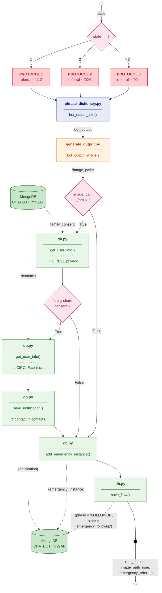

```mermaid
flowchart TD

    START(( )):::circle
    FINISH(( )):::circle
    MONGO[("MongoDB<br/>CHATBOT_mhGAP")]:::db
    MONGO2[("MongoDB<br/>CHATBOT_mhGAP")]:::db

    SWITCH{state == ?}:::decision

    S1["<b>PROTOCOL 1</b><br/>referral = '112'"]:::emergency
    S2["<b>PROTOCOL 2</b><br/>referral = '024'"]:::emergency
    S3["<b>PROTOCOL 3</b><br/>referral = '024'"]:::emergency

    PD["<b>phrase_dictionary.py</b><br/>───────────────<br/>bot_output_info()"]:::phrase

    IMG["<b>generate_output.py</b><br/>───────────────<br/>bot_output_image()"]:::module

    D_IMG{image_path<br/>_family ?}:::decision

    CONSENT["<b>db.py</b><br/>───────────────<br/>get_user_info()<br/>· · · · · · · · · ·<br/>→ CIRCLE.privacy"]:::dbmod

    D_CONS{family share<br/>consent ?}:::decision

    CONTACTS["<b>db.py</b><br/>───────────────<br/>get_user_info()<br/>· · · · · · · · · ·<br/>→ CIRCLE.contacts"]:::dbmod

    NOTIF["<b>db.py</b><br/>───────────────<br/>save_notification()<br/>· · · · · · · · · ·<br/>∀ contact in contacts"]:::dbmod

    EMG["<b>db.py</b><br/>───────────────<br/>add_emergency_instance()"]:::dbmod

    FLOW["<b>db.py</b><br/>───────────────<br/>save_flow()"]:::dbmod

    BOTTOM(( )):::junction

    START -->|"state"| SWITCH
    SWITCH -->|"3"| S3
    SWITCH -->|"2"| S2
    SWITCH -->|"1"| S1

    S1 & S2 & S3 --> PD
    PD -->|"bot_output"| IMG
    IMG -->|"*image_paths"| D_IMG

    D_IMG -->|False| EMG
    D_IMG -->|True| CONSENT --> D_CONS
    D_CONS -->|False| EMG
    D_CONS -->|True| CONTACTS --> NOTIF --> EMG

    EMG --> FLOW --> BOTTOM

    MONGO2 -.->|"family_consent"| CONSENT
    MONGO2 -.->|"*contacts"| CONTACTS
    NOTIF -.->|"{notification}"| MONGO
    EMG -.->|"{emergency_instance}"| MONGO
    FLOW -.->|"(phase = 'FOLLOWUP',<br/>state = 'emergency_followup')"| MONGO

    BOTTOM -->|"(bot_output, image_path_user,<br/>*emergency_referral)"| FINISH

    classDef circle    fill:#ffffff,stroke:#9370db,stroke-width:2px,color:#ffffff
    classDef junction  fill:#000000,stroke:#000000,color:#000000
    classDef module    fill:#fff3e0,stroke:#e65100,color:#bf360c
    classDef decision  fill:#fce4ec,stroke:#ad1457,color:#880e4f
    classDef dbmod     fill:#e8f5e9,stroke:#2e7d32,color:#1b5e20
    classDef db        fill:#c8e6c9,stroke:#1b5e20,color:#1b5e20
    classDef phrase    fill:#e8eaf6,stroke:#283593,color:#1a237e
    classDef emergency fill:#ffcdd2,stroke:#b71c1c,color:#b71c1c
```