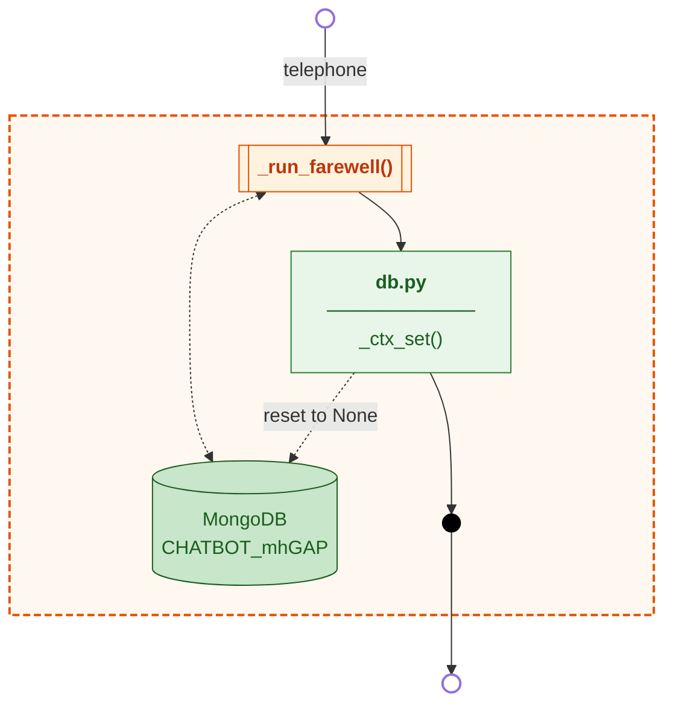

```mermaid
flowchart TD
    START(( )):::circle
    FINISH(( )):::circle

    START -->|"telephone"| FARE

    subgraph RESET_SESSION["&nbsp;&nbsp;&nbsp;&nbsp;&nbsp;&nbsp;&nbsp;&nbsp;&nbsp;&nbsp;&nbsp;&nbsp;&nbsp;&nbsp;&nbsp;&nbsp;&nbsp;&nbsp;&nbsp;&nbsp;&nbsp;&nbsp;&nbsp;&nbsp;&nbsp;&nbsp;&nbsp;&nbsp;&nbsp;&nbsp;&nbsp;&nbsp;&nbsp;&nbsp;&nbsp;&nbsp;&nbsp;&nbsp;&nbsp;&nbsp;&nbsp;&nbsp;&nbsp;&nbsp;&nbsp;&nbsp;&nbsp;&nbsp;&nbsp;&nbsp;&nbsp;&nbsp;&nbsp;&nbsp;&nbsp;&nbsp;&nbsp;&nbsp;&nbsp;&nbsp;&nbsp;&nbsp;&nbsp;&nbsp;&nbsp;&nbsp;&nbsp;&nbsp;&nbsp;&nbsp;&nbsp;&nbsp;&nbsp;&nbsp;&nbsp;&nbsp;&nbsp;&nbsp;&nbsp;&nbsp;&nbsp;&nbsp;&nbsp;&nbsp;&nbsp;&nbsp;&nbsp;&nbsp;&nbsp;&nbsp;&nbsp;&nbsp;&nbsp;&nbsp;&nbsp;&nbsp;&nbsp;&nbsp;&nbsp;&nbsp;&nbsp;&nbsp;&nbsp;&nbsp;&nbsp;&nbsp;&nbsp;&nbsp;&nbsp;&nbsp;&nbsp;&nbsp;&nbsp;&nbsp;&nbsp;&nbsp;&nbsp;&nbsp;&nbsp;&nbsp;"]
        FARE[["<b>_run_farewell()</b>"]]:::module
        CTX["<b>db.py</b><br/>───────────<br/>_ctx_set()"]:::dbmod
        MONGO[("MongoDB<br/>CHATBOT_mhGAP")]:::db
        BOTTOM(( )):::junction

        FARE --> CTX
        FARE <-.-> MONGO
        CTX -.->|"reset to None"| MONGO
        CTX --> BOTTOM
    end

    BOTTOM --> FINISH

    classDef circle   fill:#ffffff,stroke:#9370db,stroke-width:2px,color:#ffffff
    classDef junction fill:#000000,stroke:#000000,color:#000000
    classDef module   fill:#fff3e0,stroke:#e65100,color:#bf360c
    classDef dbmod    fill:#e8f5e9,stroke:#2e7d32,color:#1b5e20
    classDef db       fill:#c8e6c9,stroke:#1b5e20,color:#1b5e20

    style RESET_SESSION fill:#fff8f0,stroke:#e65100,stroke-width:2px,stroke-dasharray: 6 3

```