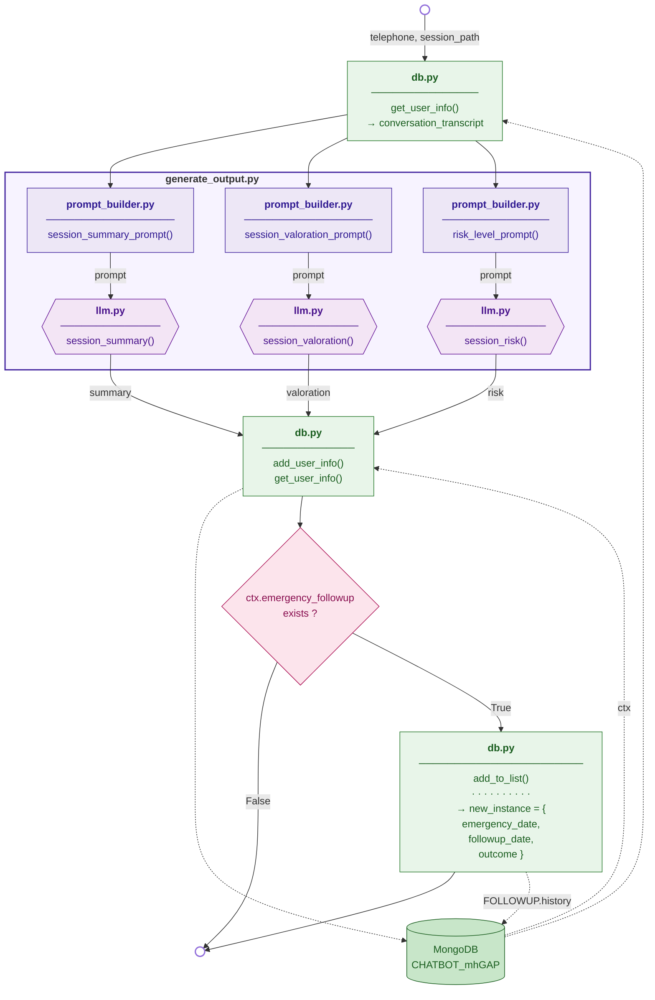

```mermaid
flowchart TD

    START(( )):::circle
    FINISH(( )):::circle

    CONV["<b>db.py</b><br/>───────────────<br/>get_user_info()<br/>→ conversation_transcript"]:::dbmod

    subgraph PARALLEL["<b>generate_output.py &nbsp;&nbsp;&nbsp;&nbsp;&nbsp;&nbsp;&nbsp;&nbsp;&nbsp;&nbsp;&nbsp;&nbsp;&nbsp;&nbsp;&nbsp;&nbsp;&nbsp;&nbsp;&nbsp;&nbsp;&nbsp;&nbsp;&nbsp;&nbsp;&nbsp;&nbsp;&nbsp;&nbsp;&nbsp;&nbsp;&nbsp;&nbsp;&nbsp;&nbsp;&nbsp;&nbsp;&nbsp;&nbsp;&nbsp;&nbsp;&nbsp;&nbsp;&nbsp;&nbsp;&nbsp;&nbsp;&nbsp;&nbsp;&nbsp;&nbsp;&nbsp;&nbsp;&nbsp;&nbsp;&nbsp;&nbsp;&nbsp;&nbsp;&nbsp;&nbsp;</b>"]
        PB_S["<b>prompt_builder.py</b><br/>──────────────────<br/>session_summary_prompt()"]:::prompt
        PB_V["<b>prompt_builder.py</b><br/>──────────────────<br/>session_valoration_prompt()"]:::prompt
        PB_R["<b>prompt_builder.py</b><br/>───────────────<br/>risk_level_prompt()"]:::prompt
        LLM_S{{"<b>llm.py</b><br/>──────────────<br/>session_summary()"}}:::llm
        LLM_V{{"<b>llm.py</b><br/>──────────────<br/>session_valoration()"}}:::llm
        LLM_R{{"<b>llm.py</b><br/>──────────────<br/>session_risk()"}}:::llm
    end

    DB_SAVE["<b>db.py</b><br/>─────────────<br/>add_user_info()<br/>get_user_info()"]:::dbmod

    MONGO[("MongoDB<br/>CHATBOT_mhGAP")]:::db

    D_CTX{ctx.emergency_followup<br/>exists ?}:::decision

    FU["<b>db.py</b><br/>───────────────────────<br/>add_to_list()<br/>· · · · · · · · · ·<br/>→ new_instance = {<br/>emergency_date,<br/>followup_date,<br/>outcome }"]:::dbmod

    START -->|"telephone, session_path"| CONV
    CONV --> PB_S & PB_V & PB_R

    PB_S -->|"prompt"| LLM_S
    PB_V -->|"prompt"| LLM_V
    PB_R -->|"prompt"| LLM_R

    LLM_S -->|"summary"| DB_SAVE
    LLM_V -->|"valoration"| DB_SAVE
    LLM_R -->|"risk"| DB_SAVE

    MONGO -.-> CONV
    DB_SAVE -.-> MONGO
    MONGO -.->|"ctx"| DB_SAVE

    DB_SAVE --> D_CTX

    D_CTX -->|False| FINISH
    D_CTX -->|True| FU --> FINISH

    FU -.->|"FOLLOWUP.history"| MONGO

    classDef circle    fill:#ffffff,stroke:#9370db,stroke-width:2px,color:#ffffff
    classDef module    fill:#fff3e0,stroke:#e65100,color:#bf360c
    classDef prompt    fill:#ede7f6,stroke:#4527a0,color:#311b92
    classDef llm       fill:#f3e5f5,stroke:#6a1b9a,color:#4a148c
    classDef dbmod     fill:#e8f5e9,stroke:#2e7d32,color:#1b5e20
    classDef db        fill:#c8e6c9,stroke:#1b5e20,color:#1b5e20
    classDef decision  fill:#fce4ec,stroke:#ad1457,color:#880e4f

    style PARALLEL fill:#f7f3ff,stroke:#4527a0,stroke-width:2px
```