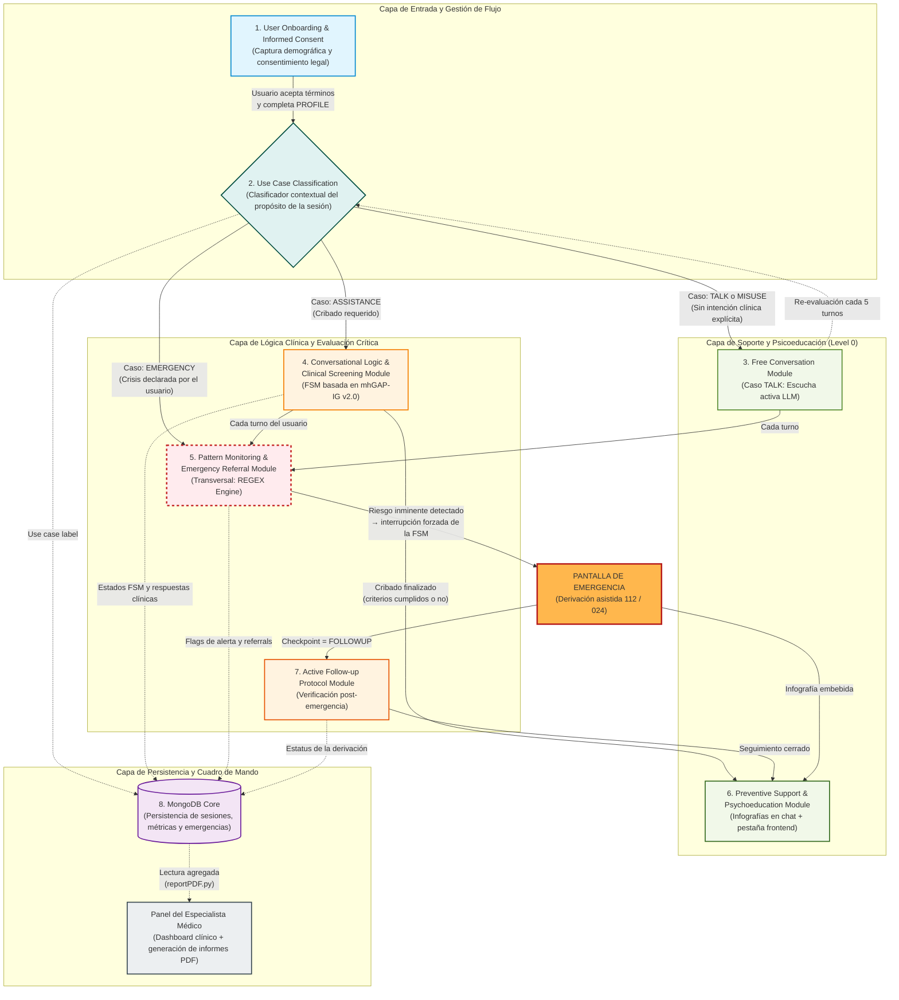

# Arquitectura Conceptual del Sistema

## ¿Qué representa este diagrama y qué lo diferencia del resto?

A lo largo del documento de arquitectura del backend (Figuras 0–6 de `backend_architecture_v2.md`) se ha presentado el sistema **desde dentro del backend conversacional**: cómo se orquesta un mensaje, qué módulos Python intervienen, qué decisiones toma la máquina de estados, cómo se persiste cada hallazgo clínico en MongoDB. Esa vista es necesariamente parcial — describe la **lógica del servidor** pero deja fuera todo lo que ocurre en los frontends y todas las funcionalidades que, aun siendo parte del sistema desplegado, no son módulos del backend.

El diagrama de esta página cubre justamente ese hueco. Es la **vista conceptual del sistema completo**, que comprende tres unidades funcionales independientes pero acopladas a través de una única base de datos:

1. **App del usuario** (frontend Flutter/web) — la interfaz conversacional para el paciente, con la pestaña de chat y una pestaña adicional de psicoeducación.
2. **Backend conversacional** (Flask + Python) — el servidor que ejecuta la FSM mhGAP, genera respuestas con LLM y persiste el estado clínico.
3. **Dashboard médico** (frontend web independiente) — la interfaz del profesional sanitario, que consume los mismos datos para supervisar pacientes y emitir documentos clínicos.

Las tres unidades comparten una única **instancia de MongoDB** como punto de verdad, pero se despliegan y autentican de forma separada. Esto es esencial entender para leer el diagrama correctamente: algunos bloques no se corresponden con módulos del backend, sino con **funcionalidades del frontend** (como la psicoeducación) o con la **app del especialista médico** (como la generación de informes PDF). Por eso esta vista conceptual no podía aparecer en los diagramas técnicos del backend — no había allí dónde representarla.

---

## Capa de Entrada y Gestión de Flujo

**M1 — User Onboarding & Informed Consent.** Es la puerta de entrada del sistema. Recoge los datos demográficos esenciales (nombre, edad), gestiona el consentimiento informado obligatorio (`USER_TERMS`) y permite al usuario configurar opcionalmente su **círculo de apoyo** (familiares o personas de confianza a las que se puede notificar en caso de emergencia, si el usuario marca explícitamente `allowContactFamily = True`). Este módulo se corresponde con las fases `PRESENTATION`, `PRESENTATION_ASKED` y `PROFILE` del backend, y con las pantallas iniciales del frontend de usuario.

**M2 — Use Case Classification.** Tras completar el perfil, el sistema clasifica la intención del usuario en uno de cuatro casos (`EMERGENCY`, `ASSISTANCE`, `TALK`, `MISUSE`) mediante una llamada al LLM con temperatura 0.0 (clasificación determinista). Esta decisión determina el flujo conversacional posterior. Conviene precisar que **este módulo no es el dispatcher central del sistema** — el orquestador real es `services_user.process_message()` en el backend, que toma decisiones turno a turno consultando el `phase` actual. M2 es un clasificador puntual que se ejecuta en momentos específicos: una vez al inicio de la sesión clínica (tras `PROFILE`), y periódicamente cada cinco turnos cuando el usuario está en modo conversación libre, para detectar si la conversación ha derivado hacia territorio clínicamente relevante.

---

## Capa de Lógica Clínica y Evaluación Crítica

**M4 — Conversational Logic & Clinical Screening Module.** Es el núcleo clínico del sistema: implementa la **máquina de estados finitos (FSM)** que recorre el protocolo mhGAP-IG v2.0 de la Organización Mundial de la Salud. Conduce al usuario a través del cribado estructurado de depresión (`DEP_EVAL`) o de riesgo suicida (`SUI_EVAL`) según corresponda, evaluando las respuestas mediante patrones REGEX y persistiendo cada hallazgo clínico en MongoDB. Corresponde íntegramente al módulo `state_machine.py` del backend, descrito en detalle en el documento de bloques de `StateMachine()`.

**M5 — Pattern Monitoring & Emergency Referral Module.** Es el componente **transversal** del sistema (representado con borde discontinuo en el diagrama). Se ejecuta en cada turno mientras el usuario esté en las fases `DEP_EVAL` o `CHAT`, escaneando el texto del usuario en busca de patrones de riesgo activo (ideación suicida, plan, autolesión inmediata) mediante REGEX. Cuando detecta un patrón crítico, **interrumpe forzosamente la FSM** y dispara los protocolos de emergencia (`SUI_PROTOCOLS`), redirigiendo al usuario a la pantalla de derivación a 112 o 024 según la severidad. Es la red de seguridad del sistema: garantiza que ninguna señal de riesgo grave queda sin respuesta inmediata, incluso si aparece en una conversación aparentemente trivial.

**M7 — Active Follow-up Protocol Module.** Activado únicamente cuando el usuario regresa al sistema **tras haber sido derivado a emergencia** en una sesión previa. La FSM detecta el checkpoint `FOLLOWUP/emergency_followup` y entra en una secuencia de seguimiento que verifica si el usuario contactó efectivamente con el servicio de emergencia, si está estable, y si necesita continuidad de cuidados. Cierra el bucle de seguridad entre la detección de crisis y el cuidado post-crisis.

---

## Capa de Soporte y Psicoeducación

**M3 — Free Conversation Module.** Modo de **escucha activa** donde el chatbot mantiene una conversación libre con el usuario sin imponer estructura clínica. Está pensado para los casos `TALK` (el usuario solo quiere desahogarse) y para el descenso natural de la conversación tras finalizar un cribado. Internamente delega la generación al LLM con temperatura 1.0, usando los últimos ocho turnos como contexto. Cada cinco turnos vuelve a invocar a M2 para detectar si el usuario ha derivado hacia territorio clínico.

### M6 — El módulo de Psicoeducación: una pieza ausente de los diagramas técnicos del backend

El módulo de psicoeducación merece una explicación pormenorizada porque ha sido deliberadamente excluido de los diagramas técnicos del backend (Figuras 0–6 de `backend_architecture_v2.md`) y eso podría dar la impresión equivocada de que el sistema no la atiende. La realidad es la opuesta: **la psicoeducación es uno de los pilares del sistema**, pero su naturaleza es atípica — no existe un fichero Python llamado `psychoeducation.py`, ni un endpoint dedicado, ni una clase con esa responsabilidad. La psicoeducación se materializa a través de **infografías** (imágenes con contenido educativo y clínicamente validado) que se entregan al usuario por dos canales coordinados pero independientes.

> **Canal 1 — Infografías embebidas en el chat (in-chat psychoeducation).** Cuando la FSM entra en estados de protocolo (`SUI_PROTOCOLS/1`, `SUI_PROTOCOLS/2`, `SUI_PROTOCOLS/3`) o en los cierres de DEP_EVAL, el backend invoca a la función `generate_output.bot_output_image()`, que selecciona una infografía clínica preparada (PNG/SVG almacenado en el servidor) y devuelve su ruta (`image_path_user`) junto al texto del bot. El frontend del usuario detecta este campo en la respuesta JSON y **embebe la imagen en el chat** justo después del mensaje textual del bot, como un mensaje gráfico más. El contenido de cada infografía se ajusta al estado clínico detectado: técnicas de regulación emocional para crisis moderadas, recursos de emergencia para situaciones graves, instrucciones específicas para acompañar a alguien en una crisis (para familiares), etc. Este mecanismo está documentado en detalle en la **Figura 5 (`SUI Protocols`)** del documento de arquitectura del backend, donde se ve cómo `image_path_user` viaja desde `generate_output.bot_output_image()` hasta el cliente del usuario. Adicionalmente, si el usuario dio consentimiento en el onboarding (`CIRCLE.privacy.allowContactFamily = True`), el sistema selecciona también una versión específica para el círculo (`image_path_family`) y la envía a los contactos guardados (`CIRCLE.contacts`) vía `save_notification()`, para que tengan instrucciones claras de cómo actuar.

> **Canal 2 — Pestaña de psicoeducación en el frontend (browse-on-demand psychoeducation).** Independientemente del chat conversacional, la app del usuario incluye **una pestaña dedicada** que aloja un catálogo navegable de infografías y guías psicoeducativas: explicaciones sobre qué es la depresión, cómo identificar señales de alarma en uno mismo y en otras personas, técnicas de mindfulness y respiración, primeros auxilios psicológicos, mapa de recursos profesionales y líneas de ayuda, etc. Este contenido es **estático respecto al backend conversacional** — no se genera dinámicamente por turno, sino que está disponible permanentemente en el frontend, y el usuario puede consultarlo cuando él decida, sin necesidad de iniciar una conversación con el chatbot. La función de esta pestaña es ofrecer un **soporte preventivo de Level 0** en la nomenclatura mhGAP: información validada accesible 24/7 que reduce la dependencia del cribado activo y empodera al usuario para reconocer y atender sus propios estados emocionales.

La combinación de ambos canales implementa el principio mhGAP de **psicoeducación contextual + recursos permanentes**: el sistema entrega la información relevante en el momento exacto de la crisis o cierre de cribado (Canal 1, push), y al mismo tiempo permite al usuario consultar el material educativo cuando él decida (Canal 2, pull). Por eso M6 aparece en este diagrama conceptual como un bloque al mismo nivel jerárquico que los módulos del backend: aunque no tiene código Python propio dedicado, **es una capa funcional plenamente identificable del sistema desplegado**, sin la cual el cumplimiento del protocolo mhGAP sería incompleto.

---

## Capa de Persistencia y Cuadro de Mando

**M8 — MongoDB Core.** Base de datos documental que almacena toda la información del sistema en una única colección de usuarios identificados por `telephone`. Cada documento contiene el perfil del usuario, los resultados de cribado (`DEP_EVAL`, `SUI_EVAL`), las instancias de emergencia (`EMERGENCY[]`), el historial de seguimientos (`FOLLOWUP.history`), las sesiones cronológicas (`session_path.*` con resumen, valoración y nivel de riesgo de cada una) y los flags de alerta. Es el **único punto de verdad** del sistema: tanto el backend conversacional como el dashboard médico leen y escriben aquí, lo que garantiza coherencia y permite que el dashboard refleje en tiempo real la actividad clínica del usuario sin necesidad de comunicación directa con el backend.

### Dashboard del Especialista Médico — una aplicación frontend independiente

Al igual que la psicoeducación, **el dashboard médico es una pieza del sistema deliberadamente excluida de los diagramas técnicos del backend** porque su arquitectura es la de una aplicación frontend independiente, no un módulo del servidor. Es una app web separada de la app del usuario, dirigida a profesionales sanitarios autorizados, que consume los mismos datos en MongoDB que el chatbot pero los presenta y procesa con fines completamente distintos. Sus funcionalidades principales son:

> **Visualización clínica.** Cuadro de mando con la lista de pacientes asignados al profesional, indicadores clave (riesgo actual, fecha de última sesión, emergencias recientes, estatus de seguimiento) y vista detallada de cada paciente con su evolución temporal a partir de los `session_path.risk_level` y `session_path.valoration` que el backend va generando al cierre de cada sesión (Figura 6 del documento de arquitectura). El dashboard transforma estos datos brutos en gráficas, líneas de tiempo y semáforos clínicos que facilitan la toma de decisiones rápida por parte del profesional.

> **Generación de documentos descargables.** Esta es la funcionalidad más relevante para situar al dashboard dentro de la arquitectura general. El backend expone un módulo dedicado, `reportPDF.py`, que **a petición del dashboard** compila los datos clínicos almacenados en MongoDB (perfil del paciente, historial completo de cribados con sus respuestas concretas, todas las emergencias registradas con fecha y referral, resúmenes generados por el LLM al cierre de cada sesión, evolución del nivel de riesgo en el tiempo) y produce **informes PDF estructurados y firmados** que el profesional descarga con un clic. Estos informes son aptos para incluirse en la historia clínica electrónica del paciente, compartirse con otros profesionales del equipo asistencial, o servir como soporte documental en derivaciones a especialistas. La generación es bajo demanda y queda registrada en un log de auditoría con timestamp, usuario solicitante e identificador del informe.

> **Gestión de alertas activas.** Cuando un paciente desencadena una emergencia (M5 dispara `SUI_PROTOCOLS`), el dashboard recibe una notificación visible que persiste hasta que el profesional confirma haber revisado el caso, garantizando que ninguna emergencia queda fuera del radar clínico. Esta capa de supervisión humana cierra el bucle de seguridad iniciado por el sistema automatizado.

La separación arquitectónica entre el dashboard y la app del usuario es deliberada y responde a varios criterios: políticas de autenticación y autorización diferenciadas (el paciente accede con su teléfono, el profesional con credenciales corporativas y MFA), políticas de privacidad distintas (el paciente solo ve sus propios datos, el profesional ve los de su cartera de pacientes asignados), y ciclos de evolución independientes (el dashboard puede añadir vistas analíticas nuevas sin tocar la app del usuario). Lo que une a ambas apps no es el código, sino el **modelo de datos compartido en MongoDB**.

---

## Pantalla de Emergencia

Es un **componente del frontend de usuario** que se activa cuando el backend devuelve `is_ended = True` con alguno de los flags `emergency_112` o `emergency_024` a `True`. Sustituye la interfaz de chat por una pantalla a pantalla completa que muestra el número de emergencia correspondiente con un botón de marcación directa, **la infografía psicoeducativa asociada al protocolo** (canal 1 de M6), y los contactos del círculo de apoyo del usuario (si están configurados) para que pueda alertarles con un toque. Esta pantalla es la **manifestación visual del compromiso de seguridad del sistema**: cuando se detecta riesgo grave, la app deja de ser un chatbot y se convierte en una herramienta de derivación inmediata. El flujo desde M5 hacia esta pantalla, y desde esta pantalla hacia M7 en la siguiente sesión, captura el ciclo completo de seguridad del sistema: detección → derivación inmediata → seguimiento posterior.

---

## Lectura del diagrama: convenciones de flujo

Las **flechas continuas** representan transiciones de control dentro de una sesión activa: qué módulo recibe el siguiente turno del usuario o el siguiente bot_output. Las **flechas discontinuas** representan persistencia o lectura asíncrona desde/hacia MongoDB — escrituras de side-effect que no afectan el flujo conversacional inmediato pero alimentan al dashboard a posteriori. La flecha discontinua de M3 a M2 marca específicamente la **re-evaluación periódica** cada cinco turnos en modo conversación libre, mecanismo que evita que el sistema quede atrapado en charla informal cuando el usuario empieza a expresar contenido clínicamente relevante.

El **borde discontinuo de M5** (único en el diagrama) indica su carácter transversal: a diferencia de los demás módulos, M5 no es un destino al que se llega, sino una capa que se ejecuta en paralelo durante las fases vulnerables de la conversación.
