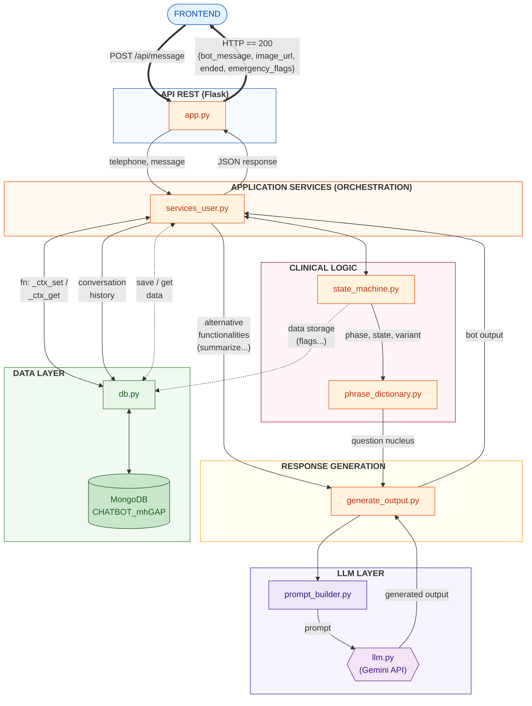
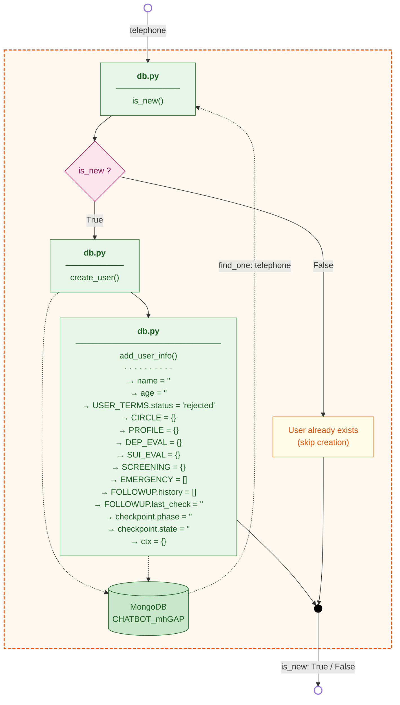
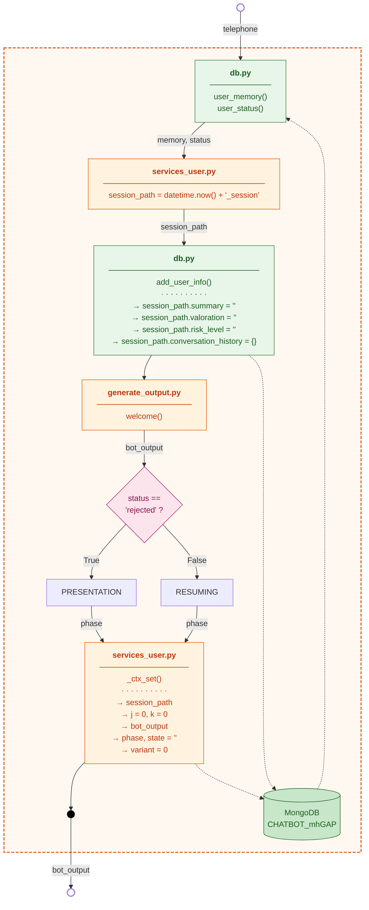
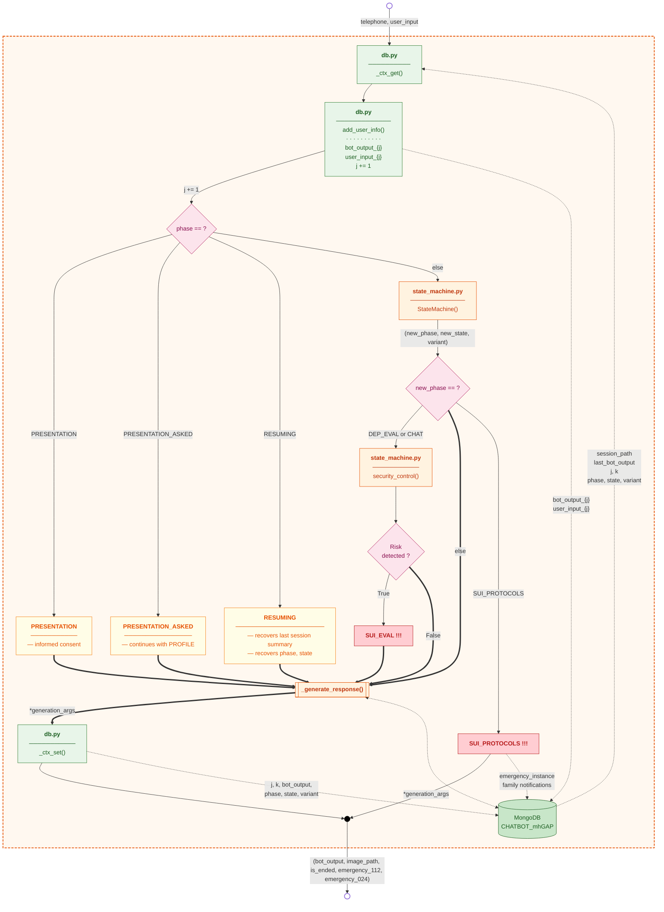
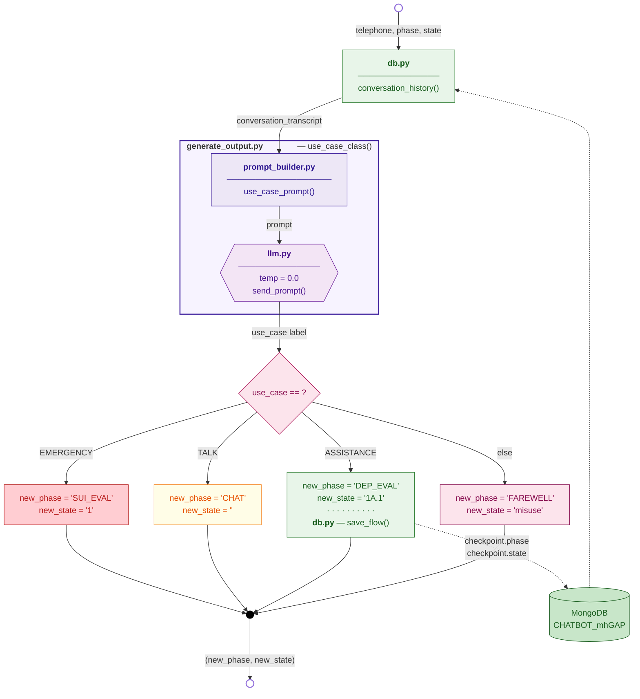
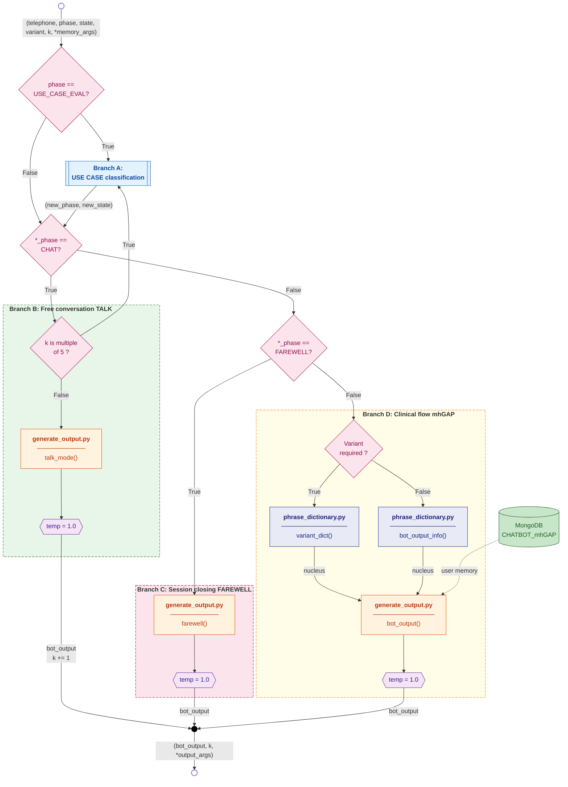
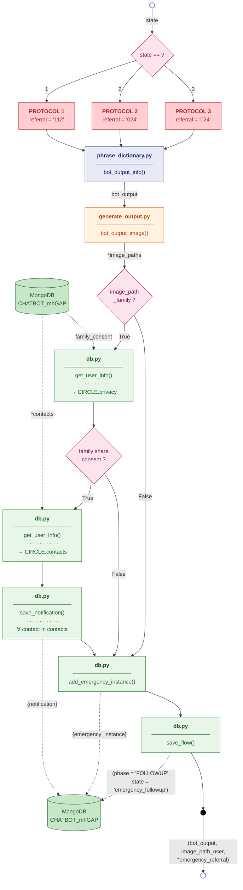
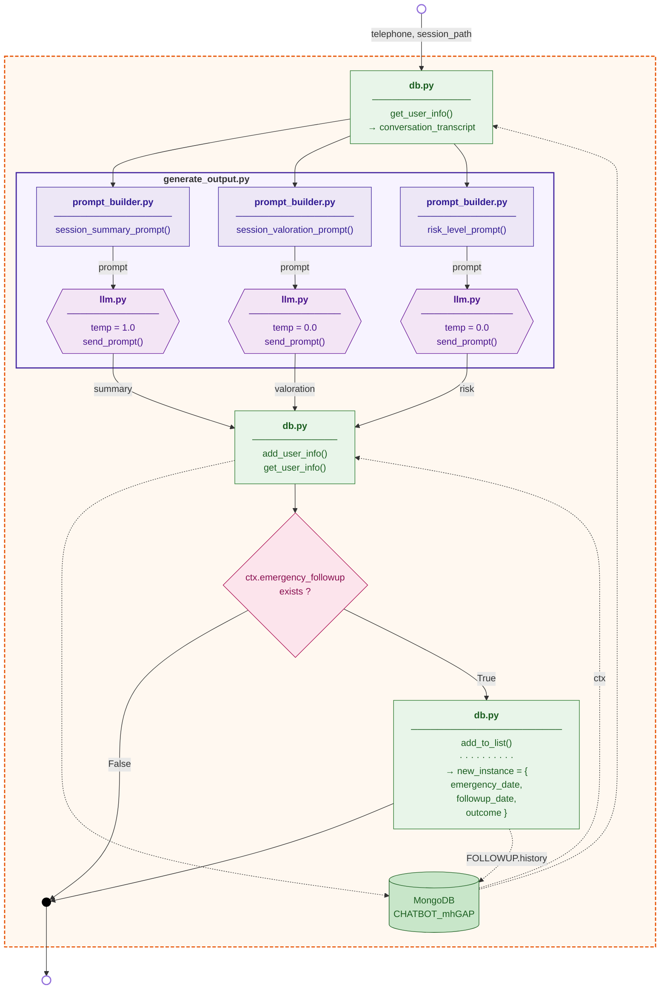

# Backend Architecture — mhGAP Chatbot v2.0

This document presents the backend flow at progressive levels of detail, following the **C4 model approach** (Context → Container → Component → Code). Each diagram can be referenced independently in the thesis text, and together they provide a complete picture of how a single user message travels through the system — from the HTTP request issued by the frontend to the persisted clinical state in MongoDB.

The system implements the **mhGAP screening protocol** of the World Health Organization for depression and suicide risk, deployed as a conversational agent. The architecture deliberately separates three concerns: **deterministic clinical logic** (encoded as a finite state machine), **natural language generation** (delegated to a large language model), and **session persistence** (a document-oriented database). This separation guarantees that clinical decisions are auditable and reproducible while keeping conversations natural and empathic.

---

## Figure 0 — System overview

High-level view of the six backend layers and the main data flows between them. The diagram intentionally omits internal logic of each module; its purpose is to convey **who calls whom** and which boundaries data crosses.

The system is organized in six concentric layers. The **API layer** (`app.py`) exposes a single Flask REST endpoint that the frontend consumes over HTTPS. The **orchestration layer** (`services_user.py`) acts as the central coordinator: it retrieves the session context from MongoDB, dispatches the user input to the appropriate sub-flow, and persists the new state at the end of each turn. The **clinical logic layer** contains the finite state machine (`state_machine.py`) that drives the mhGAP screening protocol deterministically, and the phrase dictionary (`phrase_dictionary.py`) that holds the clinical question nuclei. The **response generation layer** (`generate_output.py`) wraps each clinical nucleus with an empathic bridge produced by the LLM. The **LLM layer** isolates all calls to the Gemini API through a thin wrapper (`llm.py`) and centralizes prompt construction (`prompt_builder.py`). Finally, the **data layer** (`db.py`) is the single point of contact with MongoDB, exposing CRUD operations on session documents.



The thick arrows (`==>`) trace the **happy path** of a normal message: frontend → API → orchestrator → response generation → frontend. The thin arrows (`-->`) represent internal queries and decisions, while the dotted arrows (`-.->`) indicate side-effect persistence (writes to MongoDB that do not return values used downstream). Reading the diagram from top to bottom matches the chronological order of execution within a single turn.

---

## Figure 1 — User initialization (`init_user`)

Flow executed from `POST /api/verify` **before any chat session begins**. Its job is to ensure that every authenticated phone number has a corresponding user document in MongoDB before the conversation flow can start. If the user is new, the document is initialized with empty clinical structures; if the user already exists, the function is a no-op and simply returns the existing flag.

The result, a boolean `is_new`, is returned to the frontend so it can decide whether to display the onboarding form (terms of service, privacy policy, support circle setup) or jump directly to the chat interface for returning users. This separation between initialization and conversation start is deliberate: it allows the frontend to handle the onboarding UX without polluting the message-processing endpoint, and guarantees that every subsequent call to `process_message` can safely assume the user document exists.



The initialization populates ten clinical structures with empty defaults: `PROFILE` holds demographic data, `DEP_EVAL` and `SUI_EVAL` will store screening answers, `EMERGENCY` is a list of emergency instances, `FOLLOWUP` tracks post-emergency follow-ups, and `checkpoint` persists the FSM phase and state to support session resumption. Pre-allocating these fields with their empty types simplifies all downstream code, which can use `db.add_user_info(field, value)` without first checking whether the field exists.

---

## Figure 2 — Starting a conversation

Flow executed from `POST /api/start_conversation`, immediately after a user has been initialized (or recognized as returning). This function builds the **session context** that the orchestration layer will read on every subsequent message, and decides whether the conversation must begin with the consent presentation or can resume directly from the user's last clinical checkpoint.

The decision hinges on `USER_TERMS.status`: if the user has not yet accepted the informed consent (`status == 'rejected'`, the default for new users), the flow enters the `PRESENTATION` phase, where the bot will display the consent text and wait for explicit acceptance. If consent has already been granted in a previous session, the flow enters the `RESUMING` phase, which recovers the last conversation summary and the FSM checkpoint, allowing the user to pick up where they left off without re-explaining their situation.



The `session_path` is a timestamp-based identifier (e.g. `2026-05-28T14:30_session`) that namespaces all data persisted during this conversation. It allows multiple sessions per user to coexist in the same document without overwriting each other, and it becomes the key used by the closing flow (Figure 6) to retrieve the conversation transcript for summarization. The counters `j` (user turn) and `k` (LLM-generated turn within CHAT mode) are also initialized here and incremented on every subsequent message.

---

## Figure 3 — Orchestration flow (`process_message`)

Main execution path of `services_user.py`, invoked once per user message. The function reads the current session context from MongoDB, dispatches the user input to the appropriate sub-flow according to the current phase, applies a transversal security check when the conversation is in clinical territory, and persists the resulting state back to the database.

The dispatching is structured as a four-way switch on the current `phase`. The first three branches (`PRESENTATION`, `PRESENTATION_ASKED`, `RESUMING`) handle the conversation lifecycle and bypass the FSM entirely, going straight to response generation. The fourth branch (`else`) is the normal clinical path: the user input is fed into the finite state machine, which returns a new phase, state, and variant. Once the FSM has produced its decision, a **second switch** on `new_phase` determines what happens next: if the conversation is in `DEP_EVAL` or `CHAT`, a transversal `security_control()` scans the input for risk patterns (suicidal ideation, self-harm, immediate danger) and may override the FSM's decision to escalate the conversation to `SUI_EVAL`; if `new_phase` is `SUI_PROTOCOLS`, the system bypasses normal response generation and triggers the emergency protocols (see Figure 5); otherwise, the flow proceeds to `_generate_response()` as usual.



The conversation history is persisted **before** any decision is made (`HIST` block), so that the user's message is recorded even if downstream code raises an exception. This append-only design simplifies debugging and audit: every turn produced by every user is available for forensic analysis. The two-phase persistence pattern — read context at the start, write it back at the end — guarantees that each call is atomic from the database's perspective.

---

## Figure 4.0 — USE_CASE_EVAL

Detailed view of the `use_case_class()` function within `generate_output.py`. This block is activated when the FSM enters the `USE_CASE_EVAL` phase, which happens either at the very beginning of the conversation (right after `PROFILE` completes) or periodically inside the free conversation mode (every five turns of `CHAT`, see Figure 4). Its job is to read the recent conversation transcript and classify the user's overall intent into one of four categories, then route the conversation accordingly.

The classification is delegated to the LLM with **temperature 0.0** — the lowest setting available — to ensure the output is deterministic and reproducible. Unlike empathic generation, this is a pure classification task where creativity would be harmful: the same input should always yield the same label, and the label must come from a closed vocabulary of four values. The result is then matched against a four-way switch that sets the next phase and state.



The four labels reflect mutually exclusive intent categories. **EMERGENCY** indicates that the user has expressed an immediate crisis (suicidal ideation, acute distress) and triggers the suicide risk evaluation. **ASSISTANCE** routes the user to the formal mhGAP depression screening; this is the only branch that explicitly persists the checkpoint to MongoDB, since the user has consented to a structured clinical assessment. **TALK** keeps the user in the free conversation mode, allowing for venting or non-clinical dialogue. The default branch **MISUSE** catches anything that does not fit the previous categories (off-topic, abuse, testing the bot) and gracefully ends the session.

---

## Figure 4 — Response generation (`_generate_response`)

Internal detail of `_generate_response()`: four mutually exclusive branches selected by `*_phase` (which can mean either the incoming `phase` or the new `new_phase` produced by the FSM, depending on the branch). The function implements the **hybrid response architecture** that defines this chatbot: a fixed clinical nucleus retrieved from a deterministic phrase dictionary, wrapped by an empathic bridge generated by the LLM at temperature 1.0.

The four branches embody different generation strategies. **Branch A** (`USE_CASE_EVAL`) re-classifies the user intent — see Figure 4.0. **Branch B** (`CHAT`) is free conversation mode with an additional inner check: every five turns, the system silently re-runs use case classification to detect if the user has drifted into clinical territory (suicidal ideation, request for help), in which case it can leave CHAT and re-enter the screening flow. **Branch C** (`FAREWELL`) generates the closing message and triggers the session-closing flow described in Figure 6. **Branch D** is the **default clinical path**: the phrase dictionary returns either the base nucleus (`bot_output_info`) or a variant nucleus (`variant_dict`, used when the user response was evasive, ambiguous, hostile, or otherwise unexpected), and the LLM produces an empathic bridge that incorporates user memory (name, age, profile, prior summaries) to personalize the question without altering its clinical content.

> *Note on the `*_phase` notation*: the wildcard `*_phase` in the decision diamonds indicates that the condition applies to **either** `phase` or `new_phase`, depending on the calling context. This is necessary because branches B and C can be entered both directly (the FSM had already set the phase to CHAT or FAREWELL in a previous turn) or as a fresh transition (`new_phase` just changed to CHAT or FAREWELL in the current turn).



The temperature of 1.0 used in branches B, C, and D is the key parameter that gives the bot its natural conversational tone. Higher temperatures cause the LLM to sample from a broader probability distribution over tokens, yielding more varied and creative phrasing — desirable when the clinical content is already fixed by the phrase dictionary, and the LLM's only job is to make the question sound human rather than scripted. This contrasts sharply with the temperature 0.0 used for classification tasks (see Figure 4.0) and is one of the most important architectural decisions of the system.

---

## Figure 5 — SUI Protocols

Detailed flow of the suicide intervention protocols, triggered when the FSM enters the `SUI_PROTOCOLS` phase. This block executes outside the normal response generation path: instead of calling `_generate_response()`, the system directly retrieves the bot message from the phrase dictionary and triggers a series of side effects — image dispatch, family notification, emergency registry, and a forced transition to the post-emergency follow-up phase.

The protocol level is determined by `state`. **PROTOCOL 1** is the most critical: it routes the user to the Spanish 112 emergency number and is reserved for situations where the user has expressed immediate intent or has a specific plan. **PROTOCOLS 2 and 3** route to the 024 psychological emergency line and cover less acute but still serious ideation; they share the same referral because their clinical handling is identical, differing only in the message content (psychoeducation, support reinforcement). All three protocols then converge into a shared pipeline that retrieves the appropriate clinical phrase, dispatches an image (a visual support card for the user, plus optionally one for their family circle), and registers the emergency in MongoDB.



The **family notification subflow** is one of the most sensitive paths in the system and is governed by explicit user consent. When a family-targeted image exists for the current protocol (`image_path_family`), the system reads the user's `CIRCLE.privacy.allowContactFamily` flag from MongoDB. Only if the user has explicitly opted in during onboarding will the system iterate over the user's emergency contacts (`CIRCLE.contacts`) and dispatch a notification to each one. This design enforces the principle that **no third party is contacted without prior consent**, even in life-threatening situations — a constraint dictated by both legal and ethical considerations.

Finally, `save_flow()` forces the FSM to transition to `FOLLOWUP / emergency_followup` so that the next interaction with the user (which may happen hours or days later) will trigger the post-emergency follow-up flow rather than continuing the previous clinical screening. This guarantees that no emergency goes without a follow-up check.

---

## Figure 6 — Session closing (`_run_farewell`)

Full flow of the closing process: clinical summary generation, session valuation, risk level assessment, and persistence to MongoDB. This function is invoked at the end of every session, regardless of how it ended (normal farewell, age-related rejection, misuse exit, or post-emergency wrap-up). Its purpose is to produce three pieces of structured metadata that will be consumed in future sessions: a **summary** of what was discussed, a **valuation** of the user's emotional progression during the session, and a **risk level** numeric score.

The three artifacts are generated **in parallel**: the same conversation transcript is fed into three different prompts (`session_summary_prompt`, `session_valoration_prompt`, `risk_level_prompt`) and the LLM is called three times with different temperatures. The summary uses temperature 1.0 because the output is free-form prose where natural language fluency matters; the valuation and risk level use temperature 0.0 because they produce structured outputs (a categorical valuation, a numeric score) that must be reproducible. Running them in parallel rather than sequentially is a deliberate optimization: each LLM call takes 1-3 seconds, so the parallel pattern reduces total latency from ~9 seconds to ~3 seconds.



After the three artifacts are persisted, the flow checks whether the closing session was triggered by a previous emergency (`ctx.emergency_followup` exists). If so, a new follow-up instance is appended to the user's `FOLLOWUP.history` list, recording the date of the original emergency, the date of this follow-up, and the outcome (which may be derived from the risk level computed above). This list is later consulted by the orchestrator to remind the user to check in periodically after an emergency event, closing the safety loop that the architecture is designed to provide.

---

## How to export to image

```bash
npm install -g @mermaid-js/mermaid-cli

# One SVG per figure (recommended for LaTeX or Word documents)
mmdc -i backend_flow_diagram.md -o fig1_overview.svg
mmdc -i backend_flow_diagram.md -o fig2_orchestration.svg

# High-resolution PNG
mmdc -i backend_flow_diagram.md -o fig1_overview.png -w 2400
```

Alternatively, paste each code block into **https://mermaid.live** for individual preview and export.