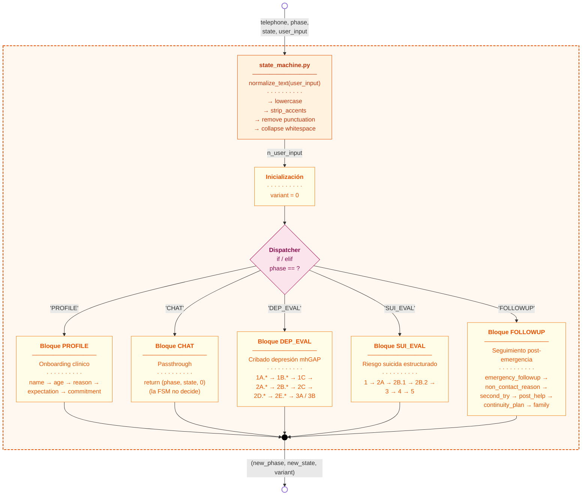
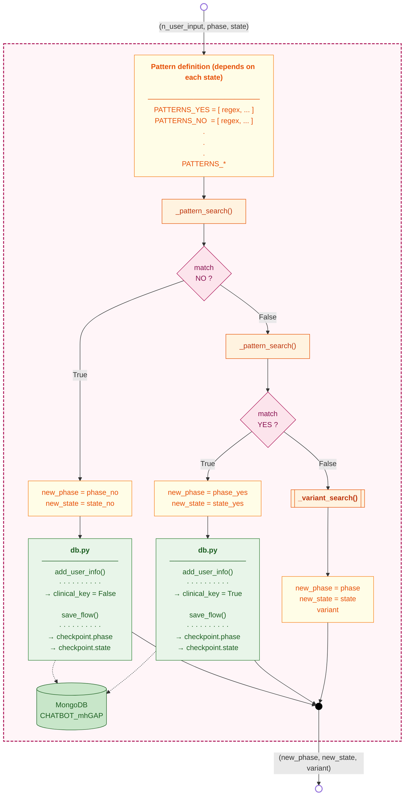
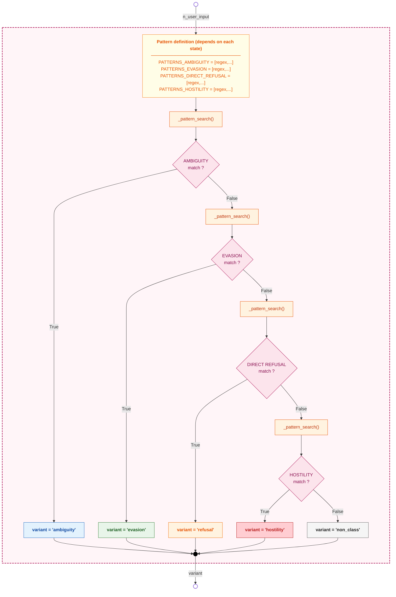

# Diagramas de bloques de la función `StateMachine()`

Este documento contiene tres diagramas de bloques complementarios que capturan el comportamiento de la función `StateMachine()` del módulo `state_machine.py`, desde la vista de conjunto hasta el patrón interno que se replica en cada uno de sus estados.

- **Figura 1** — Comportamiento general: firma, normalización, dispatcher de fases y salida.
- **Figura 2** — Patrón canónico de decisión por estado: cómo se determina cada transición.
- **Figura 3** — Cascada interna de `variant_search()`.

---

## Figura 1 — Comportamiento general de `StateMachine()`

Captura el rol de la función como **dispatcher determinista**: recibe la tupla de contexto desde `services_user.py`, normaliza el texto, identifica la fase actual y delega a uno de los cinco sub-bloques internos. La salida es siempre la tripleta `(new_phase, new_state, variant)`, sin generación de texto.



---

## Figura 2 — Patrón canónico de decisión por estado

Diagrama del comportamiento que se repite, con pequeñas variantes, en **cada uno de los estados** dentro de los bloques `PROFILE`, `DEP_EVAL`, `SUI_EVAL` y `FOLLOWUP`. Captura la lógica de evaluación de patrones REGEX, persistencia en MongoDB y decisión de transición.

Es importante notar que la persistencia ocurre **solo cuando hay match positivo** (es decir, cuando la respuesta del usuario se ha podido interpretar). Si la respuesta es ambigua, evasiva o no clasificable, no se guarda ningún dato clínico y el estado se mantiene para reformular la pregunta.



> **Nota** — Algunos estados específicos (por ejemplo `PROFILE.name`, `PROFILE.age`, `FOLLOWUP.non_contact_reason`) usan un único bloque de patrones específico en lugar del par `YES`/`NO` clásico, pero la lógica subyacente es idéntica: si hay match, se persiste y se avanza; si no, se llama a `variant_search()` (o se devuelve `variant = "repeat"` en los casos más simples) y se mantiene el estado.

---

## Figura 3 — Cascada interna de `variant_search()`

Esta función auxiliar se invoca **únicamente cuando los patrones principales del estado actual no han dado match**, es decir, cuando la respuesta del usuario no se ha podido interpretar como afirmación o negación clara. Su rol es **clasificar el tipo de respuesta no esperada** en una de cinco categorías, para que el resto del sistema (en particular `phrase_dictionary.variant_dict()`) pueda elegir una repregunta adecuada al contexto.

Internamente es una **cascada estricta**: las cuatro listas de patrones se evalúan en orden de prioridad clínica (ambigüedad primero, hostilidad al final) y la función retorna en cuanto encuentra el primer match. Si ninguna lista coincide, devuelve `non_class` como categoría por defecto.



---

## Tabla resumen — Etiquetas de `variant` y su uso aguas abajo

| Etiqueta | Origen | Significado clínico | Consumo posterior |
|---|---|---|---|
| `0` | Default tras match exitoso | Respuesta interpretada, la FSM avanza | `phrase_dictionary.bot_output_info()` → núcleo clínico base |
| `"repeat"` | Asignación directa en estados simples | Matcher principal sin coincidencia | `phrase_dictionary.bot_output_info()` → se repite la misma pregunta |
| `"ambiguity"` | `variant_search()` | Vaguedad, duda, "no sé" | `phrase_dictionary.variant_dict()` → reformulación más simple |
| `"evasion"` | `variant_search()` | Cambio de tema o minimización | `phrase_dictionary.variant_dict()` → redirección amable |
| `"refusal"` | `variant_search()` | Negativa explícita a responder | `phrase_dictionary.variant_dict()` → validación + reintento |
| `"hostility"` | `variant_search()` | Insulto o desconfianza hacia el bot | `phrase_dictionary.variant_dict()` → desescalada |
| `"non_class"` | `variant_search()` (default) | No encaja en ningún patrón conocido | `phrase_dictionary.variant_dict()` → repregunta neutra |

---

## Cómo exportar a imagen

```bash
npm install -g @mermaid-js/mermaid-cli

# Un SVG por figura
mmdc -i StateMachine_blocks.md -o fig1_overview.svg
mmdc -i StateMachine_blocks.md -o fig2_state_pattern.svg
mmdc -i StateMachine_blocks.md -o fig3_variant_search.svg

# PNG de alta resolución
mmdc -i StateMachine_blocks.md -o fig1_overview.png -w 2400
```

O pega cada bloque en **https://mermaid.live** para previsualizar individualmente.
