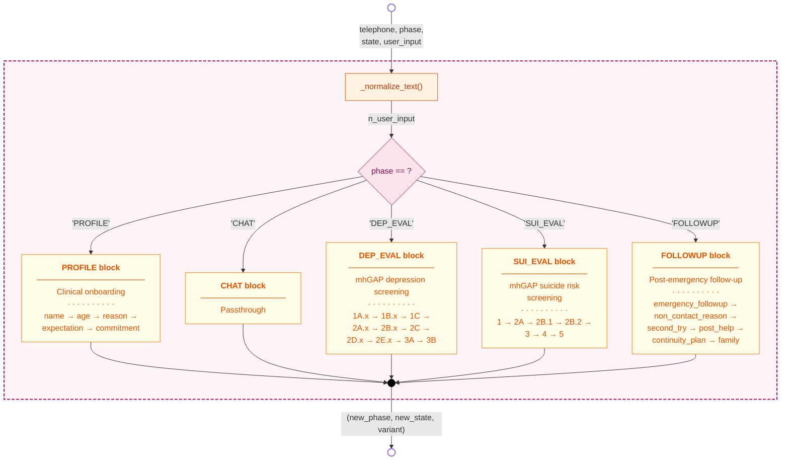
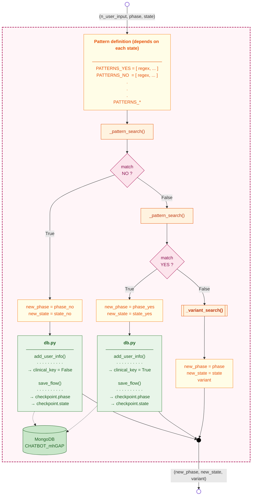
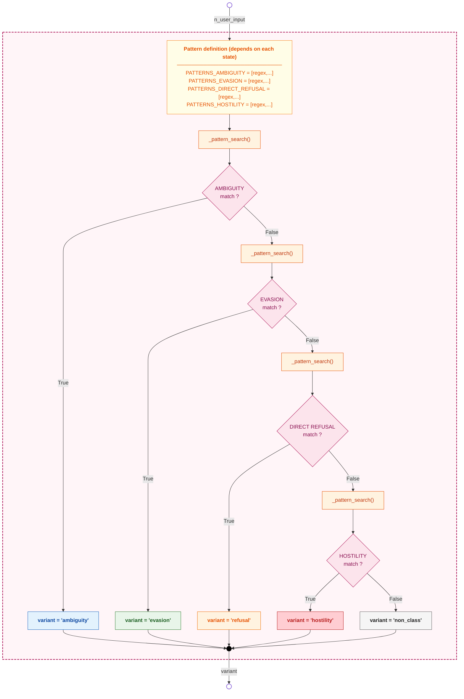

# Block diagrams of the `StateMachine()` function

This document presents three complementary block diagrams that capture the behavior of the `StateMachine()` function in `state_machine.py` — the **clinical brain** of the mhGAP chatbot. Because the function is large (roughly fifty states distributed across five phases) and the same internal pattern repeats inside every state, a single diagram would either lose detail or become unreadable. The chosen decomposition therefore moves from the most abstract view (what the function does as a whole) to the most concrete (how individual decisions are made), with each figure focusing on one level of granularity.

- **Figure 1** — General behavior: signature, normalization, phase dispatcher, and output.
- **Figure 2** — Canonical decision pattern per state: how each transition is determined.
- **Figure 3** — Internal cascade of `variant_search()`.

A summary table at the end consolidates the meaning of every `variant` value and how it is consumed downstream by `phrase_dictionary.py`.

---

## Figure 1 — General behavior of `StateMachine()`

Captures the role of the function as a **deterministic dispatcher**: it receives the session context tuple from `services_user.py`, normalizes the user input, identifies the current phase, and delegates execution to one of five internal sub-blocks. The output is always the triple `(new_phase, new_state, variant)` — never a string of natural language. This separation is deliberate: by isolating clinical decisions in a function that produces only structured data, the system guarantees that every transition is auditable and reproducible, leaving the unpredictability of natural language confined to the downstream generation layer.

The function begins with `_normalize_text()`, which lowercases the input, strips accents, removes punctuation, and collapses whitespace. This normalization is essential because the REGEX patterns used by downstream blocks would otherwise fail on trivial orthographic variations ("Sí, claro", "si claro!", "SI") that all express the same semantic content. After normalization, a single switch on `phase` dispatches the execution to the corresponding block. Each block is responsible for advancing through its own internal sequence of states, applying the canonical decision pattern described in Figure 2.



The five blocks correspond to the five phases of the conversation lifecycle. **PROFILE** is the clinical onboarding sequence — name, age, reason for contacting, expectation, and commitment to screening — and acts as a gate to the rest of the system: users under 18 are redirected to `FAREWELL`, while users who decline screening are redirected to `USE_CASE_EVAL`. **CHAT** is a pure passthrough: when the conversation is in free-talk mode, the FSM has no decision to make and simply returns the same phase and state, letting the LLM handle the conversation downstream. **DEP_EVAL** is the most complex block, implementing the mhGAP depression screening protocol with three sections and roughly thirty states. **SUI_EVAL** handles the structured suicide risk evaluation. **FOLLOWUP** manages the post-emergency check-ins that occur in subsequent sessions after a suicide-risk emergency has been registered.

---

## Figure 2 — Canonical decision pattern per state

This diagram captures the behavior that repeats, with minor variations, in **every state** within the `PROFILE`, `DEP_EVAL`, `SUI_EVAL`, and `FOLLOWUP` blocks. It abstracts the logic of REGEX pattern evaluation, MongoDB persistence, and transition decision into a single reusable template.

The pattern is structured as a **two-stage cascade**: first, the user input is tested against the negative pattern set (`PATTERNS_NO`), and only if that fails is it tested against the positive set (`PATTERNS_YES`). The order matters because negations in Spanish often contain words that would also match affirmation patterns (for example "no me siento bien" contains "bien" which could match a positive pattern), so testing `NO` first prevents false positives. If neither matcher succeeds, the system falls back to `_variant_search()` to classify the type of unexpected response.

It is critical to note that **persistence occurs only when a positive match is found** (either YES or NO branch). If the response is ambiguous, evasive, or unclassifiable, no clinical data is saved and the state remains unchanged so that the next turn can reformulate the question. This design guarantees that the MongoDB record reflects only **interpreted** answers, never assumptions made by the system.



> **Note** — Some specific states (for example `PROFILE.name`, `PROFILE.age`, `FOLLOWUP.non_contact_reason`) use a single specialized pattern block instead of the classical `YES` / `NO` pair, but the underlying logic is identical: if a match exists, persist and advance; otherwise, call `variant_search()` (or assign `variant = "repeat"` in the simplest cases) and keep the current state.

The dual persistence on positive matches — saving the clinical data via `add_user_info()` and the FSM checkpoint via `save_flow()` — is what enables **session resumption**. If the user disconnects mid-screening, the next time they open the conversation the orchestrator (Figure 2 of the architecture document) will retrieve the checkpoint and continue exactly where they left off, without re-asking questions that have already been answered. This is one of the most important guarantees of the design: clinical progress is never lost.

---

## Figure 3 — Internal cascade of `variant_search()`

This auxiliary function is invoked **only when the main patterns of the current state have failed to match**, that is, when the user's response could not be interpreted as a clear affirmation or negation. Its role is to **classify the type of unexpected response** into one of five categories, so that the rest of the system — specifically `phrase_dictionary.variant_dict()` — can choose a follow-up message appropriate to the context. A user who answered "I don't know" needs a gentler reformulation, while a user who insulted the bot needs a de-escalation; the variant label is what allows the response generator to make this distinction without any LLM call.

Internally the function is a **strict cascade**: the four pattern lists are evaluated in order of clinical priority (ambiguity first, hostility last), and the function returns as soon as it finds the first match. The order is not arbitrary — it follows from the observation that the categories are not mutually exclusive at the surface level (an evasive answer may also be ambiguous), so the priority must reflect what the system should prioritize attending to. Ambiguity is most common and least concerning; hostility is rarest but most disruptive, so it is checked last only as a final filter before the catchall.



The five output categories are visually color-coded by severity. **Ambiguity** (blue) covers vague answers such as "no sé", "tal vez", "depende"; the system treats these as honest uncertainty and reformulates the question in simpler terms. **Evasion** (green) catches topic shifts or minimization, where the user is steering the conversation away from the clinical question; the bot redirects amicably without confronting the deflection. **Refusal** (orange) is an explicit unwillingness to answer ("no quiero hablar de eso"); the bot validates the refusal before gently reattempting. **Hostility** (red) covers insults or distrust directed at the bot itself; the bot de-escalates rather than confronting. The catchall **non_class** (gray) is the default returned when nothing matched, and triggers a neutral reformulation.

---

## Summary table — `variant` labels and downstream consumption

The `variant` field is the **bridge** between the deterministic FSM and the response generation layer. The FSM produces it as one of seven possible values; `phrase_dictionary.py` consumes it to decide which clinical nucleus or alternative phrasing to retrieve. The table below consolidates the meaning of each value, where it originates, and what response strategy it triggers.

| Label | Origin | Clinical meaning | Downstream consumption |
|---|---|---|---|
| `0` | Default after successful match | Response interpreted; FSM advances | `phrase_dictionary.bot_output_info()` → base clinical nucleus |
| `"repeat"` | Direct assignment in simple states | Main matcher failed | `phrase_dictionary.bot_output_info()` → same question repeated |
| `"ambiguity"` | `variant_search()` | Vagueness, doubt, "I don't know" | `phrase_dictionary.variant_dict()` → simpler reformulation |
| `"evasion"` | `variant_search()` | Topic shift or minimization | `phrase_dictionary.variant_dict()` → gentle redirection |
| `"refusal"` | `variant_search()` | Explicit refusal to answer | `phrase_dictionary.variant_dict()` → validation + retry |
| `"hostility"` | `variant_search()` | Insult or distrust toward the bot | `phrase_dictionary.variant_dict()` → de-escalation |
| `"non_class"` | `variant_search()` (default) | Does not match any known pattern | `phrase_dictionary.variant_dict()` → neutral reformulation |

This design ensures that **no user response is ever ignored**: even when the answer is unintelligible to the FSM, the system produces an appropriate clinical response rather than failing silently or generating a generic LLM hallucination. The combination of deterministic classification (`variant`) and templated phrasing (`phrase_dictionary`) guarantees that every bot turn is clinically grounded, regardless of how unexpected the user's input was.

---

## How to export to image

```bash
npm install -g @mermaid-js/mermaid-cli

# One SVG per figure
mmdc -i StateMachine_blocks.md -o fig1_overview.svg
mmdc -i StateMachine_blocks.md -o fig2_state_pattern.svg
mmdc -i StateMachine_blocks.md -o fig3_variant_search.svg

# High-resolution PNG
mmdc -i StateMachine_blocks.md -o fig1_overview.png -w 2400
```

Alternatively, paste each block into **https://mermaid.live** for individual preview and export.