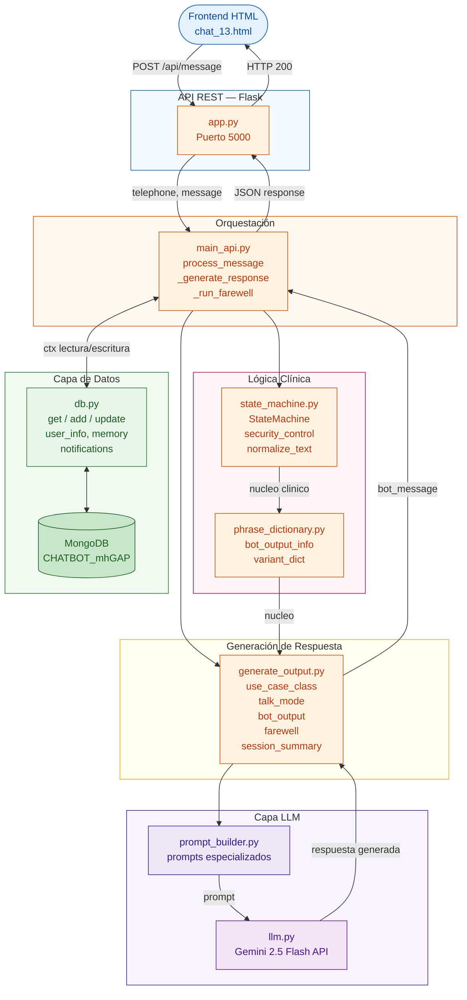
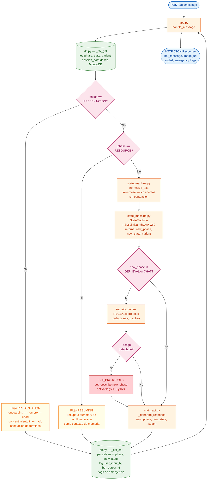
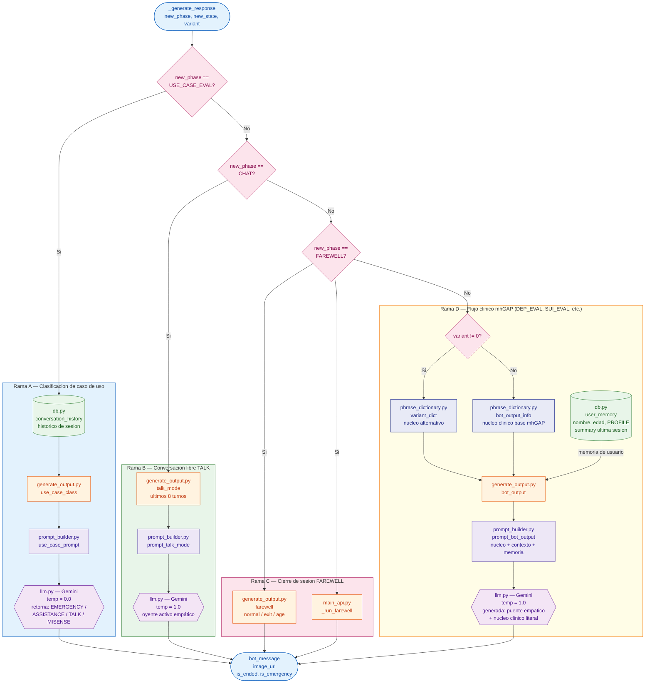
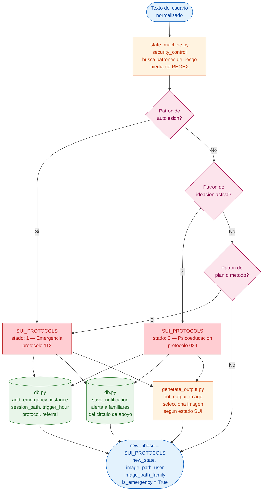
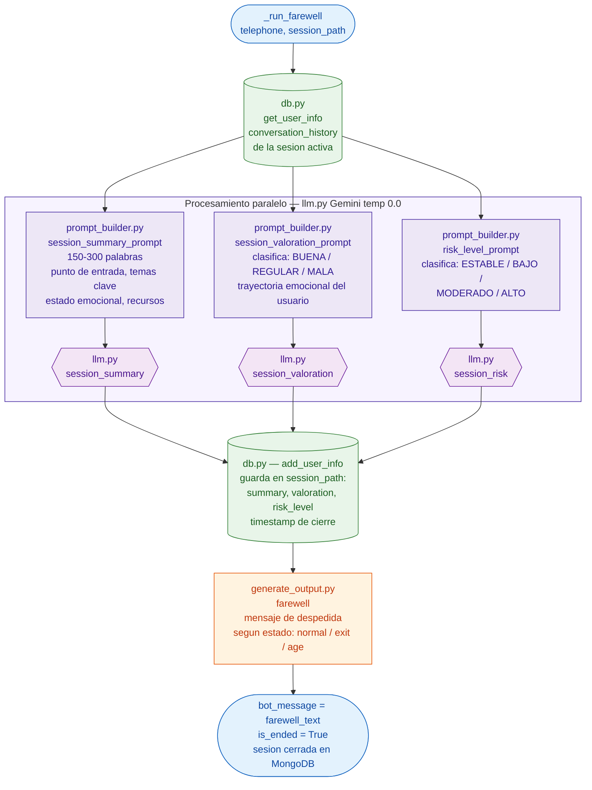

# Arquitectura del Backend — Chatbot mhGAP v2.0

Este documento presenta el flujo del backend en cuatro niveles de detalle progresivo, siguiendo el enfoque C4 (Context → Container → Component → Code). Cada diagrama puede ser referenciado de forma independiente en el texto del TFG.

---

## Figura 1 — Vista general del sistema

Visión de alto nivel de las seis capas del backend y los flujos de datos entre ellas. Muestra qué módulo llama a quién, sin entrar en la lógica interna de cada uno.



---

## Figura 2 — Flujo de orquestación (`process_message`)

Detalle del flujo principal de `main_api.py`: cómo se recupera el contexto de sesión, qué rama se toma según la fase actual y cómo se persiste el nuevo estado tras cada turno.



---

## Figura 3 — Generación de respuesta (`_generate_response`)

Detalle interno de `_generate_response`: las cuatro ramas mutuamente excluyentes según `new_phase` y la arquitectura híbrida de nucleo clínico fijo + puente generado por LLM.



---

## Figura 4 — Seguridad y cierre de sesión

### 4a — Control de seguridad transversal (`security_control`)

Flujo del módulo REGEX de detección de riesgo activo que actúa de forma transversal durante las fases `DEP_EVAL` y `CHAT`.



### 4b — Cierre de sesión (`_run_farewell`)

Flujo completo del proceso de cierre: generación de resumen clínico, valoración de la sesión y nivel de riesgo, con persistencia en MongoDB.



---

## Cómo exportar a imagen

```bash
npm install -g @mermaid-js/mermaid-cli

# Un SVG por figura (recomendado para incluir en LaTeX o Word)
mmdc -i backend_flow_diagram.md -o fig1_overview.svg
mmdc -i backend_flow_diagram.md -o fig2_orchestration.svg

# PNG de alta resolución
mmdc -i backend_flow_diagram.md -o fig1_overview.png -w 2400
```

O pega cada bloque de código en **https://mermaid.live** para previsualizar y exportar de forma individual.
